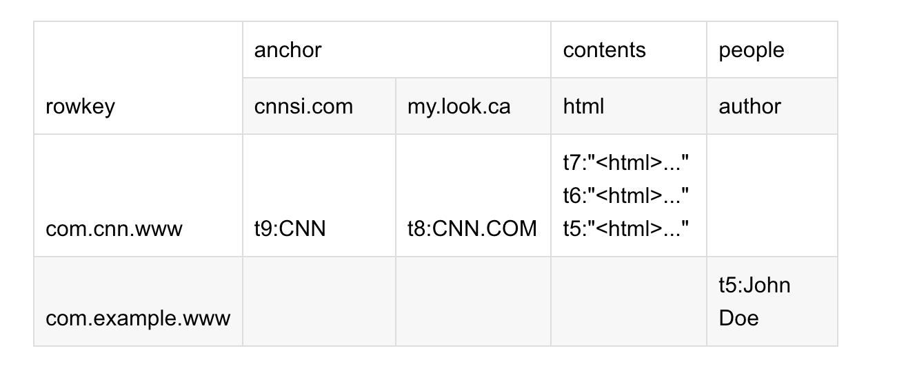
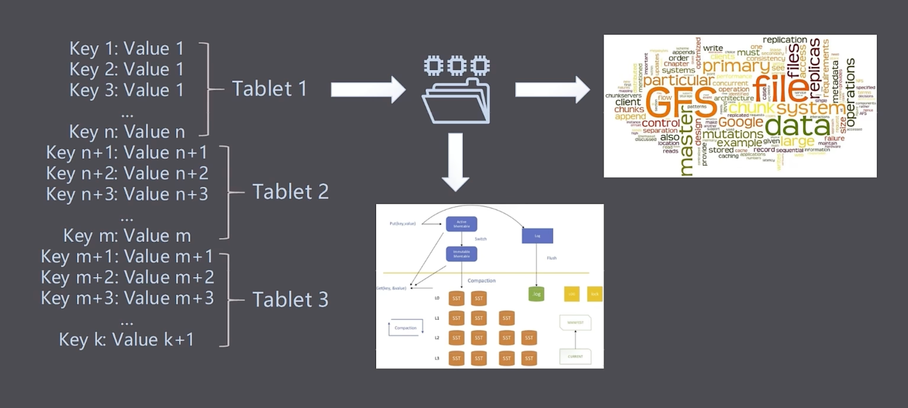
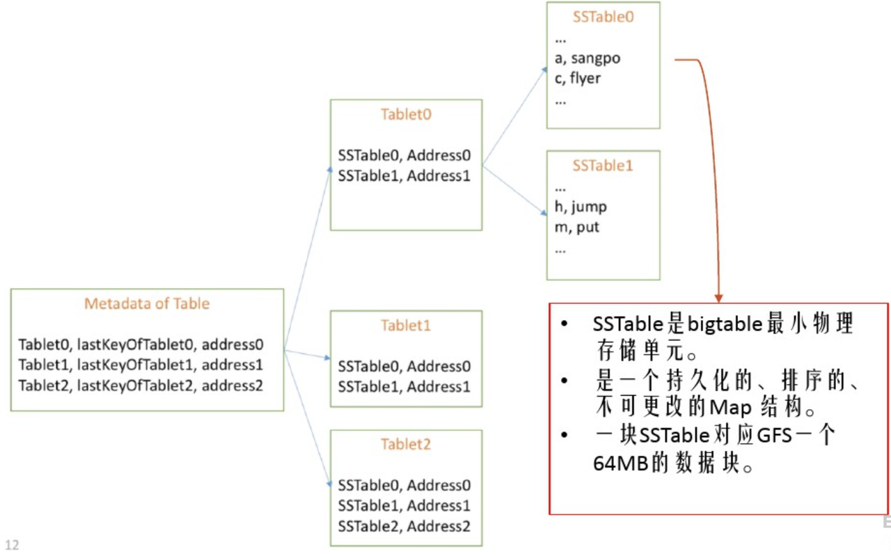
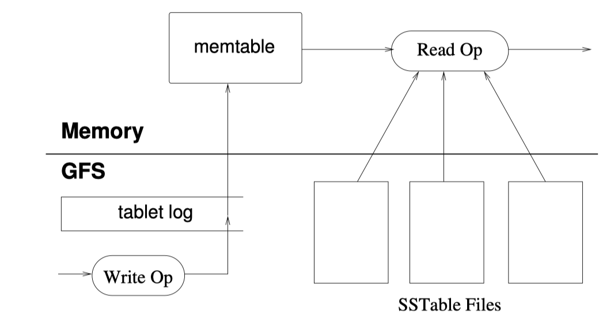

# BigTable 论文阅读笔记


## What is BigTable

> **A Distributed Storage System for Structured Data**

根据论文标题可知：目标数据为结构化数据，底层实现为分布式，且本身为一个存储系统

> Many projects at Google store data in Bigtable,including web indexing, Google Earth, and Google Finance.

对于 Google 内部应用十分广泛，但是不同的应用会存在不同的需求：

- 数据格式不同

- 吞吐量和延迟不同

- 集群规模不同

  

因此可以得知 BigTable 在具体实现上可以做到对上述侧重点的兼容性

> Bigtable has achieved several goals: wide applicability, scalability, high performance, and high availability. 

主要实现了以下特点：

- 广泛的实用性 >>> 数据格式不同
- 高性能 && 高可用 >>> 吞吐量、低延迟
- 可扩展性 >>> 集群规模不同


相对于 Parallel Databases 和 Main-Memmory Databases，实现上虽然借鉴其可扩展性与高性能的特点，但又提供与其不同的接口实现 

> Bigtable does not support a full relational data model

有过对关系型数据库的背景，会明白这是最大的不同点，关系型数据库本身数据的格式信息是可提前预知的，使得数据易于理解和管理，有助于保持数据的一致性和完整性。而 BigTable 为以下不同的表述：

- 不支持完整的关系数据模型，只为用户提供简单的数据模型
- 该模型支持动态控制数据布局和格式，并允许客户端推理底层存储中所表示的数据的局部性属性
- 数据使用可以是任意字符串的行和列名称进行索引
- 将数据视为未解释的字符串，尽管客户端未必真的就是用字符串格式进行存储，比如客户端经常将各种 structured and semi-structured（结构化和半结构化，它们不是纯文本）的序列化到 BigTable 的字符串中
- 允许客户端动态控制 BitTable 的数据来源：内存 or 磁盘


## Data Model

> **A Bigtable is a sparse, distributed, persistent multidimensional sorted map.**

BigTable 在名称上具有一定的迷惑性，（直译：大表），第一时间想到关系型数据库中的大表（数据量很大的表）如：


但实际上是一个稀疏、分布式、持久化存储的多维有序映射表：

- Sparse: 稀疏的，RowKey + ColKey 的形式存储，如：一个 Person 表，含有 Id、Name、Phone、Address、Email、City 的列信息，但是每条数据并不一定含有所有的列信息
- Distributed: 数据存储为分布式
- Persistent: 数据持久化存储
- Multidimensional Sorted Map: 这个 **Map 按照 Row Key 进行排序**，这个 Key 是一个由 `{Row Key, Column Key, Timestamp}` 组成的多维结构

即 BigTable 的每一个键值对的 Key 为 **rowKey + colKey + timestamp**，Value 则为一个字符串（未解释字节数组）：

```go
(row:string, column:string,time:int64)` -> `string
```

> 未解释的字节数组是指在 Bigtable 中存储的数据值，它们没有特定的格式或结构，而是被视为一系列字节。这些字节可以包含任何类型的数据，例如文本、数字、图像、音频等等。在 Bigtable 中，客户端通常将各种形式的结构化和半结构化数据序列化为这些未解释的字节数组，以便存储和检索。由于这些字节数组没有特定的格式或结构，因此客户端需要自己负责解析和处理这些数据


**这里重点结合论文中给的示例说一下什么是 Multidimensional Sorted Map：**


先了解一下专有名词：尤其是**列簇**概念

- **Tablet**

  在 Bigtable 中，Row Key 相同的数据可以有非常多，为此 Bigtable 中表的行区间需要动态划分（也就是横向进行数据分区，横向的意思便是将表横着切），每个行区间称为一个 Tablet（子表）。**Tablet 是 Bigtable 数据分布和负载均衡的基本单位**，不同的子表可以有不同的大小。为了限制 Tablet 的移动成本与恢复成本，每个子表默认的最大尺寸为 200 MB。Tablet 是一个连续的 Row Key 区间，当 Tablet 的数据量增长到一定大小后可以自动分裂为两个 Tablet。同时 Bigtable 也支持多个连续的 Tablet 合并为一个大的 Tablet。

- **Column Key 与 Column Family**

  Column Key 一般都表示一种数据类型，Column Key 的集合称作 Column Family(列族)。**存储在同一 Column Family 下的数据属于同一种类型，Column Family 下的数据被压缩在一起保存**。

  **Column Family 是 access control（访问控制）、disk and memory accounting（磁盘和内存计算）的基本单元**。数据在被存储之前必须先确定其 Column Family，然后才能确定具体的 Column Key，并且表中的 Column Family 不宜过多，通常几百个。但 Column key 的个数并不进行限制，可以有无限多个。在 Bigtable 中列关键字的命名语法为：`family:qualifier` 即 `"列族:限定词"`，**列族名称必须是可打印的字符串，限定词则可以是任意字符串**。如 Webtable 中名为 anchor 的列族，该列族的每一个列关键字代表一个锚链接；anchor 列族的限定词是引用网页的站点名，每列的数据项是链接文本。

- **TimeStamp**

  **Bigtable 中的表项可以包含同一数据的不同版本**，采用时间戳进行索引。时间戳是 64 位整型，既可以由系统赋值也可由用户指定。时间戳通常以 us（微秒）为单位。时间戳既可以由 Bigtable 进行分配，也可以由客户端进行分配，如果应用程序希望避免冲突，应当生产唯一的时间戳。

  **表项的不同版本按照时间戳倒序排列（大的在前，时间戳越大表明数据加入的时间越晚）**，即最新的数据排在最前面，因而每次查询会先读到最新版本。**为了简化多版本数据的管理，每个列族都有两个设置参数用于版本的自动回收**，用户可以指定保存最近 N 个版本，或保留足够新的版本(如最近 7 天的内容)

按照表的概念举例一些数据：



anchor、contents、people 为三个列簇，我们可以根据 `rowkey + colkey + ts` 定位到一个具体的 value，如：`com.cnn.www + anchor:cnnsi.com + t9` 定位到 `CNN` 

上述数据转化为一个 Map<K,V> 数据是怎样的呢？规则如下：`rowkey + col family + qualifier + type + timestamp`

```go
{"com.cnn.www","anchor","cnnsi.com","put","t9"} -> "CNN"

同理，其他的KV还有：

{"com.cnn.www","anchor","my.look.ca","put","t8"} -> "CNN.com"

{"com.cnn.www","contents","html","put","t7"} -> "<html>..."

{"com.cnn.www","contents","html","put","t6"} -> "<html>..."

{"com.cnn.www","contents","html","put","t5"} -> "<html>..."

{"com.example.www","people","author","put","t5"} -> "John Doe"
```

到此再来审视一下 BigTable 的描述词：

- 多维：key 是一个复合数据结构，由多维元素构成，包括 rowkey、column family、qualifier、type 以及 timestamp
- 稀疏：从上图逻辑表中行 "com.example.www" 可以看出，整整一行仅有一列（people：author）有值，其他列都为空值。在其他数据库中，对于空值的处理一般都会填充 null，而对于 BigTable，空值不需要任何填充。这个特性为什么重要？因为列在理论上是允许无限扩展的，对于成百万列的表来说，通常都会存在大量的空值，如果使用填充null的策略，势必会造成大量空间的浪费。因此稀疏性是列可以无限扩展的一个重要条件
- 排序：构成数据的 KV 在同一个文件中都是有序的，但规则并不是仅仅按照 rowkey 排序，而是按照 KV 中的 key 进行排序——先比较 rowkey，rowkey 小的排在前面；如果 rowkey 相同，再比较 column，即 column family：qualifier，column 小的排在前面；如果column 还相同，再比较时间戳 timestamp，即版本信息，timestamp 大的排在前面。这样的多维元素排序规则对于提升 BigTable 的读取性能至关重要
- 分布式：很容易理解，构成 BigTable 的所有 Map 并不集中在某台机器上，而是分布在整个集群中


## Building Blocks

> 1. Bigtable uses the distributed Google File System (GFS) to store log and data fifiles. 
> 2. A Bigtable cluster typically operates in a shared pool of machines that run a wide variety of other distributed applications,
>
> and Bigtable processes often share the same machines with processes from other applications. 
>
> 3. Bigtable depends on a cluster management system for scheduling jobs, managing resources on shared machines, dealing
>
> with machine failures, and monitoring machine status.

主要依赖如下：

- 依赖 SSTable 来存储数据单元
- 依赖 WorkQueue 负责故障处理和监控
- 依赖 GFS 存储日志文件和数据文件
- 依赖 Chubby 存储元数据和进行主服务器的选择


Bigtable 主要由链接到每个客户端的程序库、主服务器和多个子表服务器组成，其架构如下图所示。为了适应工作负载的变化，可以动态地向集群中添加或删除子表服务器

Bigtable 本质是一个**进程**，Bigtable 进程通常与其他应用程序的进程共享同一台机器。Bigtable 依赖于集群管理系统来调度作业、管理共享机器上的资源、处理机器故障和监视机器状态


### SSTable

> An SSTable provides a persistent, ordered immutable map from keys to values, where both keys and values are arbitrary byte strings. Operations are provided to look up the value associated with a specifified key, and to iterate over all key/value pairs in a specifified key range.

SSTable 为 BigTable 的基本存储单元，提供一个持久化、有序的、不可变的映射：

- 键值对都是任意字节字符串；
- 提供查找与制定关联值的操作；
- 提供迭代遍历指定值所有键值对的操作；

> Internally, each SSTable contains a sequence of blocks (typically each block is 64KB in size, but this is configurable). A block index (stored at the end of the SSTable) is used to locate blocks; the index is loaded into memory when the SSTable is opened. A lookup can be performed with a single disk seek: we first find the appropriate block by performing a binary search in the in-memory index, and then reading the appropriate block from disk. Optionally, an SSTable can be com- pletely mapped into memory, which allows us to perform lookups and scans without touching disk.

每个SSTable内部包含一系列数据块（通常每个块的大小为64KB，但这是可配置的）:

- 块索引（存储在SSTable的末尾）用于定位块，当打开SSTable时，索引会被加载到内存中；
- 可以使用单个磁盘查找来执行查找操作：通过在内存中的索引中执行二进制搜索来找到适当的块，然后从磁盘中读取适当的块；


### GFS

GFS是Google的分布式文件系统，用于在Bigtable中存储SSTable和其他元数据。GFS提供高可靠性、高可扩展性和高性能的存储服务。


### Chubby

**Bigtable 依赖于 Chubby 提供的锁服务**，如果 Chubby 长时间不能访问，Bigtable 会无法使用。Bigtable 依赖 Chubby 完成以下任务：

- 确保任意时间至多存在一个活跃的主服务器副本；

  > 即 At most one active master at any time.

- 存储 Bigtable 中数据的 bootstrap location（引导位置）；

- 发现 Tablet（子表）服务器，并在子表服务器失效时进行善后；

- 存储 Bigtable 的 schema 信息，即表的 column family 信息；

- 存储 access control lists（访问控制列表）；

**注意**：如果集群内的 Chubby 在长时间内不可用（比如宕机或者网络问题），那么整个 Bigtable 系统也将会不可用。但是如果系统内仅仅是部分 Chubby 不可用，那么事实上只会导致 Bigtable 的部分数据不可用。


## Implementation

主要有三部分：

> a library that is linked into every client, one master server, and many tablet server

客户端、Master 主服务器、Tablet 子表服务器

### Master Server

> The master is responsible for assigning tablets to tablet servers, detecting the addition and expiration of tablet servers, balancing tablet-server load, and garbage collection of fifiles in GFS. In addition, it handles schema changes such as table and column family creations

主要用于为子表服务器分配子表、检测子表服务器的加入或过期、 进行子表服务器的负载均衡和对保存在 GFS 上的文件进行垃圾收集。主服务器持有活跃的子表服务器信息、子表的分配信息和未分配子表的信息。如果子表未分配，主服务器会将该子表分配给空间足够的子表服务器。此外在表和列簇创建的时候处理 Schema 变更。


### Tablet Server

> Each tablet server manages a set of tablets (typically we have somewhere between ten to a thousand tablets per tablet server). The tablet server handles read and write requests to the tablets that it has loaded, and also splits tablets that have grown too large.

**每个子表服务器管理一组子表（a set of tablets）**，负责其磁盘上的子表的读写请求，并在子表过大时进行子表的分割。与许多单一主节点的分布式存储系统一样，读写数据时，客户端直接和子表服务器通信，因此在实际应用中，主服务器的负载较轻。


### Client

客户端使用客户端程序库访问 Bigtable，客户端库会缓存子表的位置信息。当客户端访问 Bigtable 时，首先要调用程序库中的 `Open()` 函数获取文件目录，文件目录可能在缓存中，也可能通过与主服务器进行通信得到。最后再与子表服务器通信


### Tablet

我们来看一下 Bigtable 中数据调度的基本单位 Tablet



Bigtable 将 key 排序之后，会进行分区，也就是 range，将一个 range 的数据成为 **Tablet**，每一个 tabet 就对应了 GFS 中的文件，每个 Tablet 都有一个全剧唯一的文件名，一个 Tablet 就相当于一个 LSM Tree，文件由磁盘中的 SSTable、内存中的 Memtable 以及一份 WAL组成。

**强调**：一个 Tablet 在物理上对应 GFS 中的一个文件，逻辑上为一个完整的 LSM Tree，同时 LSM Tree 契合 GFS 的追加写操作

**到这里不禁思考？我们在寻找数据的时候怎么定位到要找的那个 Tablet 呢？**

我们需要 Tablet location


#### Tablet Location

> We use a three-level hierarchy analogous to that of a ***B+tree***  to store **tablet location information**.
>
> The fifirst level is a fifile stored in Chubby that contains the location of the ***root tablet***,  and it is never
>
> split to ensure that the tablet location hierarchy has no more than three levels.


可以看到 Bigtable 将子表按照三层关系进行组织

第0层，存储在 Chubby file中，里面包含了 Root tablet 的位置信息。

> 由于该文件是 Chubby 文件，也就意味着 Chubby 服务不可用，整个 Bigtable 服务就会丢失 Root Tablet 的位置信息。

第1层，根子表 (Root tablet) ，元数据子表 (METADATA tablets) 中的第一个子表，它存储着元数据表里其他子表的位置信息，根子表随着大小的增长是不会被分割的。

第2层，METADATA，其中每个 tablet 包含了一个 usertablet 的集合。

> 每个 METADATA Tablet 存储 Tablet 位置信息时，Row Key 是通过对 Tablet Table Identifier 和 End Row Key 生成的

第3层，由多个 usertable 存储的最终数据项。


我们再次带入一些实例来观测上述子表组织结构：




回到刚才的问题，我们如何定位 **tablet**?：

> 在查找子表的时候，客户机首先会检查自己的库，看是否已经有这个子表位置的缓存。
>
> 如果存在这个缓存且这个缓存还有效(客户程序使用的库会缓存Tablet的位置信息)，就会按照这个位置去获取子表信息。
>
> 如果这个子表的缓存信息错误，那么客户机将会递归向上一层的子表服务器进行查询。
>
> 若缓存为空，则客户机将会从 Chubby file 开始获取根子表的位置，查询根子表查寻相应元数据子表的位置，再在元数据字表中找到需要的数据子表的位置，完成完整的一次询问的查找。

**至于如何保证高可用？**

基于 GFS 存储系统的 Bigtable 的存储逻辑则如下图所示：

[](https://spongecaptain.cool/images/img_paper/image-20200803220617756.png)

特点是：

- 拥有相同 row key 的键值对分为多个 Tablet 进行分布式存储（每一个 Tablet 默认大小为 200 MB），如果字节大小不足以填满 200 MB，那么也需要占用一个 Tablet 大小（这种情况不常见）；
- Tablet 是 Bigtable 中数据分布和负载均衡的最基本单位，这个性质对于 GFS 系统来说，就是 GFS 会为每一个 Tablet 默认提供 3 个副本，每一个副本尽量存储在不同机架上的不同主机的磁盘上；


#### Tablet Assignment

主服务器 Master 主要负责监控子表服务器状态以及子表的分配。主服务器需要通过 Chubby 确认每个子表服务器是否还在正常工作，跟踪子表都分配给了哪些子表服务器以及哪些子表还没有被分配。

> 在任何一个时刻，一个 Tablet 只能分配给一个 Tablet 服务器

当一个 Tablet还没有被分配、并且刚好有一个Tablet服务器有足够的空闲空间装载该 Tablet 时，Master 服务器会给这个 Tablet 服务器发送一个装载请求，把 Tablet 分配给这个服务器。

Bigtable 使用 Chubby 跟踪记录 Tablet 服务器的状态。

1. 当一个 Tablet 服务器启动流程：

> 在 Chubby 的一个指定目录下建立一个唯一的文件，并且获取该文件的独占锁。

2. Master 如何管理 Tablet 服务器:

> Master 服务器实时监控着这个目录（服务器目录），因此 Master 服务器能够知道有新的 Tablet 服务器加入了。当 Tablet 服务器终止时（比如，集群的管理系统将该 Tablet 服务器的主机从集群中移除），它会尝试释放它持有的文件锁，这样一来，Master 服务器就能尽快把 Tablet 分配到其它的Tablet服务器。

3. Tablet 服务器如何工作？

> 如果 Tablet 服务器丢失了 Chubby 上的独占锁——比如，由于网络断开导致 Tablet 服务器和 Chubby 的会话丢失——它就停止对 Tablet 提供服务。（Chubby 提供了一种高效的机制，利用这种机制，Tablet 服务器能够在不增加网络负担的情况下知道它是否还持有锁）。
>
> 只要文件还存在，Tablet 服务器就会试图重新获得对该文件的独占锁；如果文件不存在了，那么 Tablet 服务器就不能再提供服务了，它会自行退出。此时 Master 服务器将会把 Tablet 迁移。

4. Master 如何管理 Tablet 服务器

> Master 服务器负责检查一个 Tablet 服务器是否已经不再为它的 Tablet 提供服务了，并且要尽快重新分配它加载的 Tablet (给其它 Tablet 服务器)。
>
> Master 服务器通过轮询 Tablet 服务器文件锁的状态来检测何时 Tablet 服务器不再为 Tablet 提供服务。如果一个 Tablet 服务器报告它丢失了文件锁，或者 Master 服务器最近几次尝试和它通信都没有得到响应，Master 服务器就会尝试获取该 Tablet 服务器文件的独占锁；如果 Master 服务器成功获取了独占锁，那么就说明Chubby是正常运行的，而 Tablet 服务器要么是宕机了、要么是不能和 Chubby 通信了，因此，Master 服务器就删除该 Tablet 服务器在 Chubby 上的服务器文件以确保它不再给 Tablet 提供服务。
>
> 一旦 Tablet 服务器在 Chubby 上的服务器文件被删除了，Master 服务器就把之前分配给它的所有的 Tablet 放入未分配的 Tablet集合中。为了确保 Bigtable 集群在 Master 服务器和 Chubby 之间网络出现故障的时候仍然可以使用，Master 服务器在它的Chubby 会话过期后主动退出。但是不管怎样，如同我们前面所描述的，Master 服务器的故障不会改变现有 Tablet 在 Tablet 服务器上的分配状态。

5. Master 服务器启动过程

当集群管理系统启动了一个 Master 服务器之后，Master 服务器首先要了解当前 Tablet 的分配状态，之后才能够修改分配状态。Master服务器在启动的时候执行以下步骤：

- Master 服务器从 Chubby 获取一个唯一的 Master 锁，用来阻止创建其它的 Master 服务器实例；
- Master 服务器扫描 Chubby 的服务器**文件锁**存储目录，获取当前正在运行的 Tablet 服务器列表；
- Master 服务器和所有的正在运行的 Tablet 服务器通信，获取每个 Tablet 服务器上 Tablet 的分配信息；
- Master 服务器扫描 METADATA 表获取所有的 Tablet 的集合。在扫描的过程中，当 Master 服务器发现了一个还没有分配的 Tablet，Master 服务器就将这个 Tablet 加入未分配的 Tablet 集合并等待合适的时机分配。

可能会遇到一种复杂的情况：在 METADATA 表的 Tablet 还没有被分配之前是不能够扫描它的。因此，在开始扫描之前（步骤4），如果在第三步的扫描过程中发现 Root Tablet 还没有分配，Master 服务器就把 Root Tablet 加入到未分配的Tablet集合。这个附加操作确保了Root Tablet 会被分配。由于 Root Tablet 包括了所有 METADATA 的 Tablet 的名字，因此 Master 服务器扫描完 Root Tablet 以后，就得到了所有的 METADATA 表的 Tablet 的名字了。

保存现有 Tablet 的集合只有在以下事件发生时才会改变：**建立了一个新表或者删除了一个旧表、两个Tablet被合并了、或者一个Tablet被分割成两个小的 Tablet**。Master 服务器可以跟踪记录所有这些事件，因为除了最后一个事件外的两个事件都是由它启动的。

Tablet 分割事件需要特殊处理，因为它是由 Tablet 服务器启动。在分割操作完成之后，Tablet 服务器通过在 METADATA 表中记录新的Tablet 的信息来提交这个操作；当分割操作提交之后，Tablet 服务器会通知 Master 服务器。如果分割操作已提交的信息没有通知到Master 服务器（可能两个服务器中有一个宕机了），Master 服务器在要求 Tablet 服务器装载已经被分割的子表的时候会发现一个新的Tablet。通过对比 METADATA 表中 Tablet 的信息，Tablet 服务器会发现 Master 服务器要求其装载的 Tablet 并不完整，因此，Tablet 服务器会重新向 Master 服务器发送通知信息。


#### Tablet Serving(read and write)



> **Write Op**：示意图中写操作的数据流也来自于 GFS 文件系统，首先写入也存储于 GFS 日志系统中(磁盘中)，然后写入内存中的 Memtable。此时写操作已经结束了，没有涉及将记录直接写入 SSTable 中的步骤；
>
> **Read Op**：读操作的数据来源可以是内存中的 Memtable，也可以是磁盘中的 SSTable；


一个 Tablet 的持久化状态是存储在 GFS 中的，如图所示。更新被提交到一个提交日志，日志中记录了 redo 记录。在这些更新当中，最近提交的更新被存放到内存当中的一个被称为 memtable 的排序缓冲区，比较老的更新被存储在一系列 SSTable 中。

为了恢复一个Tablet，Tablet 服务器从 METADATA 表当中读取这个 Tablet 的元数据。这个元数据包含了 SSTable 列表，其中每个 SSTable 都包括一个 Tablet 和一个重做点（redo point）的集合，这些 redo point 是一些指针，它们指向那些可能包含 Tablet 所需数据的重做日志。服务器把 SSTable 索引读入内存，执行重做点以后的所有已经提交的更新来重新构建 memtable。

当一个写操作到达 Tablet 服务器时，服务器首先检查它定义是否良好，并且发送者是否被授权执行该变更。执行授权检查时，会从一个Chubby 文件中读取具有访问权限的写入者的列表，这个 Chubby 文件通常总能够在 Chubby 客户端缓存中找到。一个有效的变更会被写入提交日志中。分组提交是为了优化许多小变更操作的吞吐量。在写操作已经被提交以后，它的内容就会被插入到 memtable。

当一个读操作到达 Tablet 服务器，与写操作类似，服务器也会首先检查它是否是良好定义和得到授权的。一个有效地读操作是在一系列SSTable 和 memtable 的合并的视图上执行的。由于 SSTable 和 memtable 是字典排序的数据结构，视图合并的执行效率很高。

当 Tablet 发生合并或分割操作时，正在到达的读写操作仍然可以继续进行。

> 在Bigtable中，当tablet发生合并或分割操作时，正在到达的读写操作仍然可以继续进行。这是因为Bigtable使用了一种称为“版本链”的技术，它允许在合并或分割期间继续进行读写操作。具体来说，Bigtable使用一个称为“memtable”的内存缓存来存储最新的写入操作，同时使用一组称为“SSTables”的磁盘文件来存储旧的写入操作。当一个读操作到达时，Bigtable会将memtable和SSTables合并成一个排序的视图，并在其中查找所需的数据。当一个写操作到达时，它会被写入memtable，并在后台异步地写入SSTables。在合并或分割期间，Bigtable会将memtable和SSTables分别拆分成更小的部分，并将它们合并成新的memtable和SSTables。这些操作不会影响正在进行的读写操作，因为它们仍然可以访问旧的memtable和SSTables，同时也可以访问新的memtable和SSTables。这种技术使得Bigtable能够在不停机的情况下进行合并和分割操作，从而提高了系统的可用性和性能。


#### Compactions

随着写操作的执行，memtable的大小逐渐增加。当memtable的大小到达一个阈值的时候，memtable就会被冻结然后创建一个新的memtable，被冻结的memtable就转化成一个SSTable并被写入到GFS。这个*小压缩（minor compaction）*过程有两个目标：它缩小了tablet服务器的内存使用率；当发生服务器宕机需要恢复时可以减少了需要从重做日志中读取的数据量。当压缩过程正在进行时，正在到达的读写操作仍然可以继续进行。

每一次小压缩都会创建一个新的SSTable，如果这种行为没有约束地持续进行，读操作可能需要从任意数量的SSTable中合并更新。相反，我们会对这种文件的数量进行限制，我们在后台周期性地运行一个合并压缩程序。一个合并压缩程序从一些SSTable和memtable中读取内容，并且写出一个新的SSTable。一旦压缩过程完成，这个输入的SSTable和memtable就可以被删除。

一个合并压缩程序，把所有的SSTable的数据重写到一个SSTable，这个合并压缩被称为“主压缩”（major compaction）。非主压缩所产生的SSTable可以包含特殊的删除入口（entry），它把被删除的数据压缩在仍然存活的比较老的SSTable当中。另一方面，一个主压缩过程，产生一个不包含删除信息或被删除的数据的SSTable。BigTable定期检查它的所有tablet，并执行主压缩操作。这些主压缩过程可以允许BigTable收回被删除数据占用的资源，并且保证被删除数据在一定时间内就可以及时的从系统中消失，这对于一些存储敏感数据的服务来说是非常重要的。


### 客户端的数据读取流程

之前已经提到了 Bigtable 的一大特点便是提出一种不同于传统关系型数据库的模型，即更为灵活的 Key-Value 数据存储模型，对外暴露一个逻辑上的多维表：

```
(row:string, column:string, time:int64) → string
```

因此当客户端读取数据时，在内部有如下的执行流程：

- 首先，确定 Row Key；
- 其次，根据 Row Key 查找特定的 Column Key；
- 最后，根据 colomn 以及 version 确定具体读取的内容；

> 这是一个多维表查询的典型过程，这个过程类似于磁盘的直接读取，先确定分区，在顺序读写。

客户端定位子表服务器时：

- 首先，需要访问 Chubby 以获取根子表地址，然后浏览元数据表定位用户数据；
- 然后，子表服务器会从 GFS 中获取数据，并将结果返回给客户端。

Bigtable 数据访问结构如下图所示。如果客户端不知道子表的地址或缓存的地址信息不正确，客户端会递归查询子表的位置。若客户端缓存为空，寻址算法需要三次网络往返通信；如果缓存过期，寻址算法需要六次网络往返通信才能更新数据。地址信息存储在内存中，因而不必访问 GFS，但仍会预取子表地址来进一步减少访问开销。元数据表中还存储了一些次要信息，如子表的事件日志，用于程序调试和性能分析。

[](https://spongecaptain.cool/images/img_paper/image-20200725103855414.png)

通常而言，为了加快数据访问以及数据的分块存储管理，存储系统通常会提供各种排序逻辑，在 Bigtable 中的排序逻辑主要有三种：

- 利用 Row Key 进行排序，目的是横向化划分为多个 Tablet，避免形成超大块的数据，便于数据管理；
- 利用 Column key 以及 Column family 进行排序，目的是加快检索时的速度；
- 利用 timestamp 的天然时间线排序，目的是提供多版本控制以及过期数据的自动回收；


## Refinements

### Locality Groups

客户端可以把多个列族一起分组到一个 *locality group* 中。我们会为每个 Tablet 中的每个 locality group 都生成一个单独的SSTable。把那些通常不会被一起访问的列族分割在不同的 locality group，可以实现更高效的读。例如，在 WebTable 当中网页的元数据（比如语言和校验码），可以被放置到同一个 locality group 当中，网页的内容可以被放置到另一个 locality group 当中。这样想要读取页面元数据的应用就不需要去访问所有的页面内容。

另外，可以针对每个 locality group 来指定一些有用的参数。例如，一个 locality group 可以设置成存放在内存中。常驻内存的 locality group 的 SSTable 采用懒加载的方式加载到 tablet 服务器的内存中。一旦加载，属于这些 locality group 的列族，就可以被应用直接访问，而不需要读取磁盘。这个特性对于那些被频繁访问的小量数据来说是非常有用的：我们在内部使用其获取 METADATA 表的列族位置。


### Compression

客户端可以控制是否对相应于某个locality group的SSTable进行压缩，如果压缩，应该采用什么格式。用户自定义的压缩格式可以被应用到每个SSTable块中（块的大小可以通过locality group指定的参数来进行控制）。虽然对每个块进行单独压缩会损失一些空间，但是我们可以从另一个方面受益，当解压缩时只需要对小部分数据进行解压而不需要解压全部数据。许多客户端都使用两段自定义压缩模式。第一遍使用Bentley and McIlroy[6]模式，它对一个大窗口内的长的公共字符串进行压缩。第二遍使用一个快速的压缩算法，这个压缩算法在一个16KB数据量的窗口内寻找重复数据。两个压缩步骤都非常快，在现代计算机上运行，他们编码的速度是100-200MB/S，解码的速度在400-1000MB/S。

在选择我们的压缩算法时，即使我们强调速度而不是空间压缩率，这个两段压缩模式也表现出了惊人的性能。例如，在WebTable中，我们使用这种压缩模式来存储网页内容。在其中一个实验当中，我们在一个压缩后的locality group中存储了大量的文档。为了达到实验的目的，我们只为每个文档存储一个版本，而不是存储我们可以获得的所有版本。这个压缩模式获得了10：1的空间压缩率。这比传统的GZip方法的效果要好得多，GZip针对HTML数据通常只能获得3:1到4:1的空间压缩率。**这种性能上的改进是和WebTable中的行的存储方式紧密相关的，即所有来自同一个站点的网页都存储在相近的位置。**这就使得Bentley and McIlroy算法可以从同一个站点的网页中确定大量相似的内容。许多应用，不只是WebTable，都会很好地选择行名称，从而保证相似的数据可以被存放到同一个集群当中，这样就可以取得很好的压缩率。当我们在BigTable中存储同一个值的多个不同版本时，可以取得更好的压缩率。


### Caching for read performance

为了读操作的性能，Tablet 服务器使用双层缓存。扫描缓存是高层缓存，它缓存了 Tablet 服务器代码使用 SSTable 接口获取的 key-value对；块缓存是底层缓存，它缓存了从 GFS 上读取的 SSTables 块。扫描缓存主要用于倾向重复访问相同数据的应用。块缓存主要用于倾向读取近期数据附近数据的应用（如：顺序读取或随机读取同一个局域性群组的一个频繁访问行的不同列）。


### Bloom filters

一个读操作必须从所有的组成 Tablet 的 SSTable 中读取数据。如果这些 SSTable 没有在内存中，则我们最终会多次访问硬盘。我们通过允许客户端对特定局域性群组的 SSTable 指定 Bloom 过滤器来降低访问次数。一个 Bloom 过滤器允许我们查询一个 SSTable 是否含有特定的行/列对的数据。对于某些特定应用，虽然存储 Bloom 过滤器占用了 Tablet 服务器少量的内存，但能够彻底的减少读操作对磁盘的查询次数。我们使用 Bloom 过滤器也可以隐式的达到了当查询的行和列不存在时，不需要访问磁盘。

### 

### Commit-log implementation

1. 每个 Tablet 还是每个 Tablet Server 一个 log 文件

如果为每个 Tablet 维护一个单独的 log 文件，那会导致底层 GFS 大量文件的并发写。考虑到 GFS 的具体实现，这些并发写进而会导致大量的磁盘访问，以完成不同物理文件的并 发写入。另外，每个 Tablet 一个 log 文件的设计还会降低组提交（group commit，批量 提交）优化的有效性，因为每个组（group）都会很小。

 因此，为了克服以上问题，我们为**每个 Tablet Server 维护一个 commit log**，将属于这个 Tablet Server 的不同的 Tablet 操作都写入这同一个物理上的 log 文件。

2. 恢复起来比较麻烦

这种方式使得常规操作（normal operations）的性能得到了很大提升，但是，它使 tablet 恢复过程变得复杂。

 **当一个 Tablet Server 挂掉后，它负责的那些 Tablets 就会重新分配给其他（大量）的 Tablet Servers**：通常情况下每个 Tablet Server 只会分到其中的一小部分。恢复一个 Tablet 的状态时，新的 Tablet Server 需要从原 TabletServer 的 commit log 里重新 应用（reapply）这个 Tablet 的修改（mutation）。然而，**这些 Tablet 的 Mutation 都混在同一个物理的 log 文件内**。

 一种方式是每个新的 Tablet Server 都去读完整的 commit log，将自己需要的部分过滤出 来。但是，如果有 100 个机器分到了 Tablet 的话，这个 log 文件就要被读 100 次。

3. 如何解决这个问题呢？

为了避免这种重复读，我们**将 commit log 内容**以 `(table; row name; log sequence number)` 为键（key）**进行排序**。**在排序后的 commit log 中，每个 Tablet 的所有 mutation 都是连续的**，因此可以实现高效的读取：**只需一次磁盘寻址加随后的顺序读**。 为了加速排序过程，我们还将 commit log 分割成 64 MB 的段（segment），分散到多个Tablet Server 上并发地进行排序。

 这个排序过程是由 **Master 协调（coordinate）、Tablet Server 触发**的： Tablet Server 向 Master 汇报说需要从一些 commit log 中恢复一些 mutation。

写提交记录到 GFS 有时会遇到性能卡顿，这可能有多方面原因。例如，负责写操作的 GFS Server 挂了，或者到三个指定的 GFS Master 的网络发生了拥塞或过载。为了减少这些 GFS 导致的延迟抖动，**每个 Tablet Server 为 commit log 使用了两个写线程**：每个 线程写到各自的 log 文件，但同时只会有一个线程是活跃的。 如果当前的活跃线程写性能非常差，写操作就会切换到另一个线程，由这个新线程负责之后 的写。

 log 中的记录（entry）都有序列号，恢复的时候可以根据序列号过滤由于 log 切换导致 的重复数据。


### Speeding up tablet recovery

当 Master 服务器将一个 Tablet 从一个 Tablet 服务器移到另外一个 Tablet 服务器时，源 Tablet 服务器会对这个 Tablet 做一次 Minor Compaction。这个 Compaction 操作减少了 Tablet 服务器的日志文件中没有归并的记录，从而减少了恢复的时间。Compaction 完成之后，该服务器就停止为该 Tablet 提供服务。在卸载 Tablet 之前，源 Tablet 服务器还会再做一次（通常会很快）Minor Compaction，以消除前面在一次压缩过程中又产生的未归并的记录。第二次 Minor Compaction 完成以后，Tablet 就可以被装载到新的 Tablet 服务器上了，并且不需要从日志中进行恢复。


### Exploiting immutability

除了 SSTable 缓存之外，Bigtable 系统其他一些部分也因 SSTable 的不可变性而得到简化。例如，从 SSTable 读取数据时，对文件系统的访问不需要任何同步。因此，对行的并发控制可以实现地非常高效。

 **读和写操作涉及的唯一可变数据结构是 memtable**。为减少 memtable 的读竞争，我们 将 memtable 的行（row）设计为**写时复制**（copy-on-write），这样读和写就可以并行进行。

 因为 SSTable 是不可变的，所以**彻底删除数据**（permanently removing deleted data ）的问题就变成了**对过期的 SSTable 进行垃圾回收**（garbage collecting obsolete SSTables）。

 **每个 Tablet 的 SSTable 会注册到** `**METADATA**` **table**。Master 会对过期的 SSTable 进行**“先标记后清除”**（mark-and-sweep），其中 `METADATA` Table 记录了这些 SSTable 的对应的 Tablet 的 root。

 最后，**SSTable 的不可变性使得 Tablet 分裂过程更快**。我们直接让子 Tablet 共享父 Tablet 的 SSTable ，而不是为每个子 Tablet 分别创建一个新的 SSTable。


## Performance Evaluation


左表中数值的含义是每一台 Table Server 上 1000-byte 读或写操作 在一秒中发生的次数（平均负载）：

- 横向来看：随着 Tablet Server 数量的增多，每一台机器的负载都有所下降。

- 纵向来看：扫描 > 内存中的随机读 > 随机写 ≈ 顺序写 > 顺序读 > 随机读；

  > 顺序写和随机写有着近似的效率，这是因为来自客户端的写操作并不会直接导致在磁盘中进行写操作，而是仅仅写入内存。

右图中纵坐标含义为整个系统发生的 1000-byte 读或写操作在一秒中发生的次数（系统负载）：

- 横向来看：随着机器数量的上升，各项指标也会随之上升。但是注意，随着机器数达到 250 台，上升的速率均会下降；
- 纵向来看：扫描 > 内存中的随机读 > 随机写 ≈ 顺序写 ≈ 顺序读 > 随机读；


## Bigtable 设计的” 得” 与” 失”

**1.Non-SQL 接口**

提供自定义的数据读写接口而非用户已习惯的 SQL 接口，会带来额外的学习成本。

MegaStore 论文中关于 Bigtable 的评价：

> Even though many projects happily use Bigtable, we have also consistently received complaints from users that Bigtable can be difficult to use for some kinds of applications: those that have complex, evolving schemas, or those that want strong consistency in the presence of wide-area replication.

**2.Master-Slave 架构**

关于该架构的优劣已经存在很多的探讨，这里不赘述。

**3.Schema Less**

Bigtable 本是为结构化数据存储而设计的，却采用了 Schema Less 的设计。论文中提及的关于网页数据存储的场景，应该是促成该设计的最大因素。另一方面，可以猜测，**Schema 变更在 Google 内部是经常发生的**。所以，最后选定了 SSTable (在 Google 内部先于 Bigtable 而出现) 作为底层的文件存储格式。

**该设计的优势在于能够支持 Schema 的灵活变更，不需要预先定义 Schema 信息。**

但该设计的缺点也非常明显：

- Key-Value 中携带了充分的自我描述信息，导致数据有大量的膨胀。
- 在数据压缩粒度上比较受限。

**4.Range 分区**

优点：

- Range 分区能够很好的保证数据在底层存储上与 Row Key 的顺序是一致的，对 Scan 类型查询比较友好。

缺点：

- 对用户 Row Key 的设计提出了非常高的要求。
- 容易导致数据不均匀。

**5.事务支持**

Bigtable 论文中提到仅需要支持单行事务的设计初衷：

> We initially planned to support general-purpose transactions in our API. Because we did not have an immediate use for them, however, we did not implement them. Now that we have many real applications running on Bigtable, we have been able to examine their actual needs, and have discovered that most applications require only single-row transactions.

正是在 General-purpose Transaction 的驱使下，产生了后来的 MegaStore 以及 Spanner。Jeff Dean 在 2016 年的采访中表示没有在 Bigtable 中支持分布式事务是最大的一个设计遗憾：

> “What is your biggest mistake as an engineer?”
>
> Not putting distributed transactions in BigTable. If you wanted to update more than one row you had to roll your own transaction protocol. It wasn’t put in because it would have complicated the system design. In retrospect lots of teams wanted that capability and built their own with different degrees of success. We should have implemented transactions in the core system. It would have been useful internally as well. Spanner fixed this problem by adding transactions. — Jeff Dean, March 7th, 2016

从业界已广泛应用的 HBase 的应用场景来看，单行级别的事务还是可以满足大多数场景的，也正因为放弃了对复杂事务的支持，Bigtable/HBase 才能够取得吞吐量以及并发上的优势，正如上述观点中提到的，Bigtable 不加入分布式事务是不希望系统变得复杂。

Jeff Dean 将 Bigtable 不支持分布式事务视作是一大设计遗憾，相信该观点只是针对 Google 内部的应用场景需求而言，HBase 的广泛应用恰恰佐证了 Bigtable 的这一取舍是一条正确的路。就像当年 Cassandra 因最终一致性的设计惨遭 Facebook 内部遗弃，但后来在 DataStax 的扶持下依然得到了大量用户的追捧。Google/Facebook 内部场景的特殊性，以及在这种场景下所产生的技术与观点，在很多时候并不具有普适性的。

**6.计算与存储分离**

Tablet Server 中仅仅提供了数据读写服务入口，但并不存储任何数据，数据文件交由底层的 GFS/Colossus 来存储，可以说，这是一个典型的计算与存储分离的架构。

该架构优点：

- 分层设计，每一层更专注于自身的业务能力。
- Tablet 在 Tablet Server 之间迁移时，不需要移动底层的数据文件。
- Tablet Server 故障不会导致数据丢失问题。
- 可更充分的利用每一层的资源，降低整体的成本。
- 更适合云上服务架构模型。

缺点：

- 更多的网络开销。

**7.可用性**

存储于底层 GFS 中的文件有多个副本，但 Tablet 本身却是单副本的，当 Tablet Server 故障或因负载均衡原因对 Tablet 进行迁移时，就会导致 Tablet 短暂不能提供读写服务，带来可用性问题。


## Ref:

https://spongecaptain.cool/post/paper/bigtable/

https://hardcore.feishu.cn/docs/doccnY21HwJO8LckMKEGMTzvm2g#
