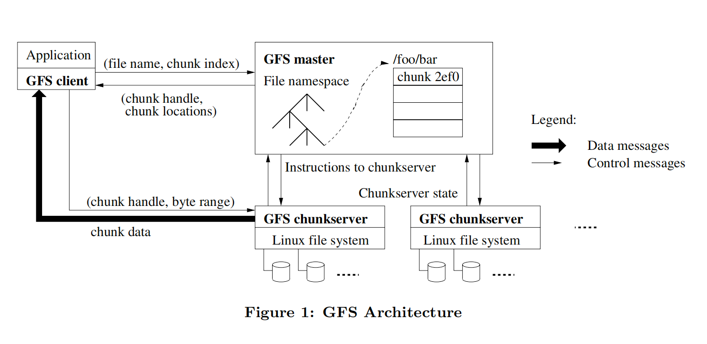

# GFS 论文阅读笔记

## What is GFS

> Google File System.
>
> A scalable distributed file system for large distributed  data-intensive applications.
>
> Fault tolerance、High aggregate preformance.

一个面向大规模数据密集型应用的、可伸缩的分布式文件系统，提供灾备能力，保证高性能的服务

> Our design has been driven by observations of our application workloads and technological environment, both current and anticipated, that reflflect a marked departure from some earlier file system assumptions.

根据 Google 内部应用的负载和技术分析，与传统的分布式文件系统有很多**明显的不同**

到底存在哪些不同？如传统分布式文件系统的特点？有哪些缺点？GFS 解决了哪些问题？

## Introduction

与传统的分布式文件系统在性能、可扩展性、可靠性、可用性上保持一致的目标

> GFS shares many of the same goals as previous distributed file systems such as performance, scalability, reliability, and availability.

不用之处主要有以下四点：

1. **组件失效被认为是常态事件**：遇到过各种各样的问题，比如 应用程序bug、操作系统的bug、人为失误，甚至还有硬盘、内存、连接器、网络以及电源失效等造成的 问题。所以，持续的监控、错误侦测、灾难冗余以及自动恢复的机制必须集成在GFS中。 

>Component failures are the norm rather than the exception.
>
>Due to problems caused by application bugs, operating system bugs, human errors, and the failures of disks, memory, connectors, networking, and power supplies.

2. **以通常的标准衡量，我们的文件非常巨大**：在采用数亿个 KB 大小的文件管理方式是非常不明智的，需要重新考虑对应的尺寸。

> Files are huge by traditional standards.
>
> When we are regularly working with fast growing data sets of many TBs comprising billions of objects, it is unwieldy to manage billions of approximately KB-sized files even when the file system could support it.

3. **绝大部分文件的修改是采用在文件尾部追加数据，而不是覆盖原有数据的方式**：对文件的随机写入操作在实际中几乎不存在。一旦写完之后，对文件的操作就只有读，而且通常是按顺序读。通常来说针对这中文件数据的访问，客户端对数据块缓存是没有意义的，数据的追加操作是性能优化和原子性保证的主要考量因素。

>Most files are mutated by appending new data rather than overwriting existing data.
>
>Random writes within a file are practically non-existent. Once written, the files are only read, and often only sequentially.

4. **应用程序和文件系统API的协同设计提高了整个系统的灵活性**： 如，我们放松了对GFS一致性模型的要求，这样就减轻了文件系统对应用程序的苛刻要求，大大简化了GFS的设计。

> Co-designing the applications and the file system API benefits the overall system by increasing our flexibility.
>
> We have also introduced an atomic append operation so that multiple clients can append concurrently to a file without extra synchronization between them.

简单总结一下：

- 增加系统的容错性
- 大文件数据处理
- 在文件尾部追加数据很常见，而非随机写或覆盖写
- 降低一致性预期的 API 设计

## Design Overview

### Assumptions

设计之初，对系统的预期目标如下：

1. **系统由许多廉价的普通组件组成，组件失效是一种常态**：失效作为一种常态，则需要系统本身必须有监控自身的能力，能够快速的发现并恢复失效的组件。

> The system is built from many inexpensive commodity components that often fail. It must constantly monitor itself and detect, tolerate, and recover promptly from component failures on a routine basis.

2. **系统能够存储一定量的大文件**：100MB 或者 GB 大小的文件支持，并且能够做到有效的管理，同时也可以兼容小文件。

> The system stores a modest number of large files. We expect a few million files, each typically 100 MB or larger in size. Multi-GB fifiles are the common case and should be managed efficiently. Small files must be supported, but we need not optimize for them.

3. **系统的工作负载主要由两种读操作组成**：大规模的流式读取和小规模的随机读取。

   1. 流式读取：通常是读取同一个文件中连续的一个区域，大规模，如数百 KB 或者 MB 的读取。

   2. 随机读取：通常是在文件某个随机位置读取，通常的做法是把小规模的随机读取操作合并并排序， 之后按顺序批量读取，这样就避免了在文件中前后来回的移动读取位置。 

> The workloads primarily consist of two kinds of reads: large streaming reads and small random reads.
>
> In large streaming reads, individual operations typically read hundreds of KBs, more commonly 1 MB or more.
>
> A small random read typically reads a few KBs at some arbitrary offset. 

4. **系统的工作负载还包括许多大规模的、顺序的、数据追加方式的写操作**：每次写入的数据的大小和大规模读类似。数据一旦被写入后，文件就很少会被修改了。系统支持小规模的随机位置写入操作，但是可能效率不高。

> The workloads also have many large, sequential writes that append data to files. Typical operation sizes are similar to those for reads. Once written, files are seldom modified again. Small writes at arbitrary positions in a file are supported but do not have to be efficient.

5. **系统必须高效的、行为定义明确的实现多客户端并行追加数据到同一个文件里的语义**：用最小的同步开销来实现的原子的多路追加数据操作是必不可少的。文件可以在稍后读取，或者是消费者在追加的操作的同时读取文件。 

> The system must efficiently implement well-defifined  semantics for multiple clients that concurrently append to the same file.

6. **高性能的稳定网络带宽远比低延迟重要**：目标程序绝大部分要求能够高速率的、大批量的处理 数据，极少有程序对单一的读写操作有严格的响应时间要求。

> High sustained bandwidth is more important than low latency.

### Interface

GFS 提供了一套类似传统文件系统的API接口函数，支持常用的操作，如创建新文件、删除文件、打开文件、关闭文件、读和写文件。 

 此外，GFS 提供了快照和记录追加操作。

- 快照以很低的成本创建一个文件或者目录树的拷贝。
- 记录追加操作允许多个客户端同时对一个文件进行数据追加操作，同时保证每个客户端的追加操作都是原子性的。

### Architecture

一个 GFS 集群包含一个单独的 Master 节点、多台 Chunk 服务器，并且同时被多个客户端访问，如图所示。

GFS 存储的文件都被分割成固定大小的 Chunk。在 Chunk 创建的时候，Master 服务器会给每个 Chunk 分配一个不变的、全球唯一的64位的 Chunk 标识。Chunk 服务器把 Chunk 以 Linux 文件的形式保存在本地硬盘上，并且根据指定的 Chunk 标识和字节范围来读写块数据。出于可靠性的考虑，每个块都会复制到多个块服务器上（通常为 3）。

 Master 节点管理所有的文件系统元数据。这些元数据包括名字空间、访问控制信息、文件和 Chunk 的映射信息、以及当前 Chunk 的位置信息。Master 节点还管理着系统范围内的活动，比如，Chunk 租用管理、孤儿 Chunk 的回收、以及 Chunk 在 Chunk 服务器之间的迁移。Master 节点使用心跳信息周期地和每个 Chunk 服务器通讯，发送指令到各个 Chunk 服务器并接收 Chunk 服务器的状态信息。 

GFS 客户端代码以库的形式被链接到客户程序里。客户端代码实现了 GFS 文件系统的API接口函数、应用程序与 Master 节点和 Chunk 服务器通讯、以及对数据进行读写操作。客户端和 Master 节点的通信只获取元数据，所有的数据操作都是由客户端直接和 Chunk 服务器进行交互的。

无论是客户端还是 Chunk 服务器都不需要缓存文件数据。客户端缓存数据几乎没有什么用处，因为大部分程序要么以流的方式读取一个巨大文件，要么工作集太大根本无法被缓存。无需考虑缓存相关的问题也简化了客户端和整个系统的设计和实现。(不过，客户端会缓存元数据)。Chunk 服务器不需要缓存文件数据的原因是，Chunk 以本地文件的方式保存，Linux 操作系统的文件系统缓存会把经常访问的数据缓存在内存中。 

### Singe Master

特点：

- 简化整体的设计
- 可以通过全聚德信息精确定位 Chunk 的位置，以及进行复制决策
- 必须减少对 Master 节点的读写，避免 Master 节点成为系统的瓶颈
- 客户端节点并不通过 Master 节点读写文件数据，只是向 Master 节点询问它听该联系的 Chunk 服务器
- 客户端主要缓存 Chunk 的元数据，后续操作可以直接和 Chunk 服务器进行数据读写操作

一次简单的读取流程如下：

1. 客户端把文件名和程序制定的字节偏移，根据固定 Chunk 的大小，转换为稳健的 Chunk 索引
2. 客户端将文件名和 Chunk 索引发送给 Master 节点，获取相应 Chunk 标识的副本的位置信息
3. 客户端将获取到的元数据信息使用文件名和 Chunk 索引作为 Key 缓存这些信息
4. 客户端将发送请求（读写）到一个最近的 Chunk 副本处，请求信息包含了 Chunk 的标识和字节范围

> 实际上，客户端通常会在一次请求中查询多个 Chunk 信息，Master 节点的回应也可 能包含了紧跟着这些被请求的 Chunk 后面的 Chunk 的信息。在实际应用中，这些额外的信息在没有任何代 价的情况下，避免了客户端和 Master 节点未来可能会发生的几次通讯。

### Chunk Size

默认为 64MB，并以普通 Linux 文件的形式保存在 Chunk 服务器上，只有在有需要的时候才扩大。

优点：

- 减少客户端与 Master 节点进行通讯的需求（毕竟文件大了 chunk 信息就少了==）
- 客户端能够对一个块进行多次操作，可以保持较长的 TCP 链接来减少网络负载

> Chunk 小尺寸情况下可能分散在多个 Chunk 中的操作现在聚集在同一个 Chunk 中。这使得 Client 与相应 Chunk Server 保持更久的连接，而非在多个 Chunk Server 间切换连接。

- 减少了 Master 节点需要保存的元数据数量（同第一点）

缺点：

- 小文件包含较少的Chunk，甚至只有一个Chunk。当有许多的客户端对同一个小文件进行多次的访问时，存储这些Chunk的Chunk服务 器就会变成热点。（即使是惰性空间分配）

### Metadata

包括：文件和 Chunk 的命名空间、文件和 Chunk 的对应关系、每个 Chunk 副本的存放地点。

以上所有的元数据都保存在 Master 服务器的内存中。

> 前两种类型的元数据(命名空间、文件和 Chunk 的对应关系)同时也会以记录变更日志的方式记录在操作系统的系统日志文件中，日志文件存储在本地磁盘上，同时日志会被复制到其它的远程Master服务器上。
>
> 采用保存变更日志的方式，我们能够简单可靠的更新Master服务器 的状态，并且不用担心Master服务器崩溃导致数据不一致的风险。
>
> Master 服务器启动后，会向各个 Chunk 服务器轮询它们所存储的 Chunk 信息

1. In-Memory Data Structures

>  因为元数据保存在内存中，所以 Master 服务器的操作速度非常快。
>
> Master 服务器可以在后台简单而高效的周期性扫描自己保存的全部状态信息。这种周期性的状态扫描也用于实现Chunk垃圾收集、在 Chunk 服务器失效的时重新复制数据、通过 Chunk 迁移实现跨 Chunk 服务器的负载均衡及磁盘使用状况统计等功能。

2. Chunk Locations

   > Master 服务器并不持久化保存哪个 Chunk 服务器存有指定 Chunk 的副本的信息。Master 服务器只是在启动的时候轮询 Chunk服务器以获取这些信息。Master 服务器能够保证它持有的信息始终是最新的，因为它控制了所有的 Chunk 位置的分配，而且通过周期性的心跳信息监控 Chunk 服务器的状态。

3. Operation Log

   > 操作日志包含了关键的元数据变更历史记录。这对 GFS 非常重要。这不仅仅是因为操作日志是元数据唯一的持久化存储记录，它也作为判断同步操作顺序的逻辑时间基线(，都由它们创建的逻辑时间唯一的、永久的标识。
   >
   > Master 服务器在灾难恢复时，通过重演操作日志把文件系统恢复到最近的状态。
   >
   > Master 服务器在日志增长到一定量时对系统状态做一个 Checkpoint，然后恢复的之后从制定 Checkpoint 开始恢复状态。

### Consistency Model

GFS 支持一个宽松的一致性模型，这个模型能够很好的支撑我们的高度分布的应用，同时还保持了相对简单且容易实现的优点。

1. ### GFS一致性保障机制 

​	文件命名空间的修改(例如，文件创建)是原子性的。它们仅由Master节点的控制:命名空间锁提供了原子性和正确性(4.1章)的保障;Master节点的操作日志定义了这些操作在全局的顺序(2.6.3章)。 

   数据修改后文件region(alex注:region这个词用中文非常难以表达，我认为应该是修改操作所涉及的文件中的某个范围)的状态取决于操作的类型、成功与否、以及是否同步修改。表1总结了各种操作的结果。如果所有客户端，无论从哪个副本读取，读到的数据都一样，那么我们认为文件region是“一致的”; 如果对文件的数据修改之后，region是一致的，并且客户端能够看到写入操作全部的内容，那么这个 region是“已定义的”。当一个数据修改操作成功执行，并且没有受到同时执行的其它写入操作的干扰，那么影响的region就是已定义的(隐含了一致性):所有的客户端都可以看到写入的内容。并行修改操作成功完成之后，region处于一致的、未定义的状态:所有的客户端看到同样的数据，但是无法读到任何一次 写入操作写入的数据。通常情况下，文件region内包含了来自多个修改操作的、混杂的数据片段。失败的修改操作导致一个region处于不一致状态(同时也是未定义的):不同的客户在不同的时间会看到不同的 数据。后面我们将描述应用如何区分已定义和未定义的region。应用程序没有必要再去细分未定义region 的不同类型。 

   数据修改操作分为写入或者记录追加两种。写入操作把数据写在应用程序指定的文件偏移位置上。即使有多个修改操作并行执行时，记录追加操作至少可以把数据原子性的追加到文件中一次，但是偏移位置是由 GFS选择的(3.3章)(alex注:这句话有点费解，其含义是所有的追加写入都会成功，但是有可能被执行了多次，而且每次追加的文件偏移量由GFS自己计算)。(相比而言，通常说的追加操作写的偏移位置 是文件的尾部。)GFS返回给客户端一个偏移量，表示了包含了写入记录的、已定义的region的起点。另外，GFS可能会在文件中间插入填充数据或者重复记录。这些数据占据的文件region被认定是不一致的， 这些数据通常比用户数据小的多。 

​          经过了一系列的成功的修改操作之后，GFS确保被修改的文件region是已定义的，并且包含最后一次修改操作写入的数据。GFS通过以下措施确保上述行为:(a) 对Chunk的所有副本的修改操作顺序一致 (3.1章)，(b)使用Chunk的版本号来检测副本是否因为它所在的Chunk服务器宕机(4.5章)而错过了修改操作而导致其失效。失效的副本不会再进行任何修改操作，Master服务器也不再返回这个Chunk副本的位置信息给客户端。它们会被垃圾收集系统尽快回收。 

​          由于Chunk位置信息会被客户端缓存，所以在信息刷新前，客户端有可能从一个失效的副本读取了数据。 在缓存的超时时间和文件下一次被打开的时间之间存在一个时间窗，文件再次被打开后会清除缓存中与该文件有关的所有Chunk位置信息。而且，由于我们的文件大多数都是只进行追加操作的，所以，一个失效的副本通常返回一个提前结束的Chunk而不是过期的数据。当一个Reader(alex注:本文中将用到两个 专有名词，Reader和Writer，分别表示执行GFS读取和写入操作的程序)重新尝试并联络Master服务器时，它就会立刻得到最新的Chunk位置信息。 

​       即使在修改操作成功执行很长时间之后，组件的失效也可能损坏或者删除数据。GFS通过Master服务器和 所有Chunk服务器的定期“握手”来找到失效的Chunk服务器，并且使用Checksum来校验数据是否损坏 (5.2章)。一旦发现问题，数据要尽快利用有效的副本进行恢复(4.3章)。只有当一个Chunk的所有副本在GFS检测到错误并采取应对措施之前全部丢失，这个Chunk才会不可逆转的丢失。在一般情况下GFS 的反应时间(alex注:指Master节点检测到错误并采取应对措施)是几分钟。即使在这种情况下，Chunk 也只是不可用了，而不是损坏了:应用程序会收到明确的错误信息而不是损坏的数据。 

2. ### 程序的实现

   使用GFS的应用程序可以利用一些简单技术实现这个宽松的一致性模型，这些技术也用来实现一些其它的目标功能，包括:尽量采用追加写入而不是覆盖，Checkpoint，自验证的写入操作，自标识的记录。 

      在实际应用中，我们所有的应用程序对文件的写入操作都是尽量采用数据追加方式，而不是覆盖方式。一种典型的应用，应用程序从头到尾写入数据，生成了一个文件。写入所有数据之后，应用程序自动将文件 改名为一个永久保存的文件名，或者周期性的作Checkpoint，记录成功写入了多少数据。Checkpoint文 件可以包含程序级别的校验和。Readers仅校验并处理上个Checkpoint之后产生的文件region，这些文 件region的状态一定是已定义的。这个方法满足了我们一致性和并发处理的要求。追加写入比随机位置写 入更加有效率，对应用程序的失败处理更具有弹性。Checkpoint可以让Writer以渐进的方式重新开始， 并且可以防止Reader处理已经被成功写入，但是从应用程序的角度来看还并未完成的数据。 

      我们再来分析另一种典型的应用。许多应用程序并行的追加数据到同一个文件，比如进行结果的合并或者是一个生产者-消费者队列。记录追加方式的“至少一次追加”的特性保证了Writer的输出。Readers使用下面的方法来处理偶然性的填充数据和重复内容。Writers在每条写入的记录中都包含了额外的信息，例如 Checksum，用来验证它的有效性。Reader可以利用Checksum识别和抛弃额外的填充数据和记录片 段。如果应用不能容忍偶尔的重复内容(比如，如果这些重复数据触发了非幂等操作)，可以用记录的唯一 标识符来过滤它们，这些唯一标识符通常用于命名程序中处理的实体对象，例如web文档。这些记录I/O功 能(alex注:These functionalities for record I/O)(除了剔除重复数据)都包含在我们的程序共享的 库中，并且适用于Google内部的其它的文件接口实现。所以，相同序列的记录，加上一些偶尔出现的重复 数据，都被分发到Reader了。