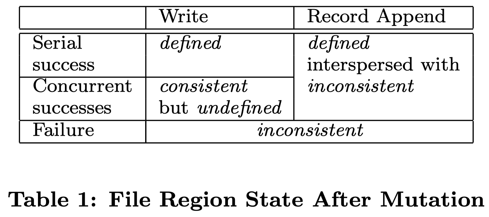

# GFS 论文阅读笔记

## What is GFS

> Google File System.
>
> A scalable distributed file system for large distributed  data-intensive applications.
>
> Fault tolerance、High aggregate preformance.

一个面向大规模数据密集型应用的、可伸缩的分布式文件系统，提供灾备能力，保证高性能的服务

> Our design has been driven by observations of our application workloads and technological environment, both current and anticipated, that reflflect a marked departure from some earlier file system assumptions.

根据 Google 内部应用的负载和技术分析，与传统的分布式文件系统有很多**明显的不同**

到底存在哪些不同？如传统分布式文件系统的特点？有哪些缺点？GFS 解决了哪些问题？

## Introduction

与传统的分布式文件系统在性能、可扩展性、可靠性、可用性上保持一致的目标

> GFS shares many of the same goals as previous distributed file systems such as performance, scalability, reliability, and availability.

不用之处主要有以下四点：

1. **组件失效被认为是常态事件**：遇到过各种各样的问题，比如 应用程序bug、操作系统的bug、人为失误，甚至还有硬盘、内存、连接器、网络以及电源失效等造成的 问题。所以，持续的监控、错误侦测、灾难冗余以及自动恢复的机制必须集成在GFS中。 

>Component failures are the norm rather than the exception.
>
>Due to problems caused by application bugs, operating system bugs, human errors, and the failures of disks, memory, connectors, networking, and power supplies.

2. **以通常的标准衡量，我们的文件非常巨大**：在采用数亿个 KB 大小的文件管理方式是非常不明智的，需要重新考虑对应的尺寸。

> Files are huge by traditional standards.
>
> When we are regularly working with fast growing data sets of many TBs comprising billions of objects, it is unwieldy to manage billions of approximately KB-sized files even when the file system could support it.

3. **绝大部分文件的修改是采用在文件尾部追加数据，而不是覆盖原有数据的方式**：对文件的随机写入操作在实际中几乎不存在。一旦写完之后，对文件的操作就只有读，而且通常是按顺序读。通常来说针对这中文件数据的访问，客户端对数据块缓存是没有意义的，数据的追加操作是性能优化和原子性保证的主要考量因素。

>Most files are mutated by appending new data rather than overwriting existing data.
>
>Random writes within a file are practically non-existent. Once written, the files are only read, and often only sequentially.

4. **应用程序和文件系统API的协同设计提高了整个系统的灵活性**： 如，我们放松了对GFS一致性模型的要求，这样就减轻了文件系统对应用程序的苛刻要求，大大简化了GFS的设计。

> Co-designing the applications and the file system API benefits the overall system by increasing our flexibility.
>
> We have also introduced an atomic append operation so that multiple clients can append concurrently to a file without extra synchronization between them.

简单总结一下：

- 增加系统的容错性
- 大文件数据处理
- 在文件尾部追加数据很常见，而非随机写或覆盖写
- 降低一致性预期的 API 设计

## Design Overview

### Assumptions

设计之初，对系统的预期目标如下：

1. **系统由许多廉价的普通组件组成，组件失效是一种常态**：失效作为一种常态，则需要系统本身必须有监控自身的能力，能够快速的发现并恢复失效的组件。

> The system is built from many inexpensive commodity components that often fail. It must constantly monitor itself and detect, tolerate, and recover promptly from component failures on a routine basis.

2. **系统能够存储一定量的大文件**：100MB 或者 GB 大小的文件支持，并且能够做到有效的管理，同时也可以兼容小文件。

> The system stores a modest number of large files. We expect a few million files, each typically 100 MB or larger in size. Multi-GB fifiles are the common case and should be managed efficiently. Small files must be supported, but we need not optimize for them.

3. **系统的工作负载主要由两种读操作组成**：大规模的流式读取和小规模的随机读取。

   1. 流式读取：通常是读取同一个文件中连续的一个区域，大规模，如数百 KB 或者 MB 的读取。

   2. 随机读取：通常是在文件某个随机位置读取，通常的做法是把小规模的随机读取操作合并并排序， 之后按顺序批量读取，这样就避免了在文件中前后来回的移动读取位置。 

> The workloads primarily consist of two kinds of reads: large streaming reads and small random reads.
>
> In large streaming reads, individual operations typically read hundreds of KBs, more commonly 1 MB or more.
>
> A small random read typically reads a few KBs at some arbitrary offset. 

4. **系统的工作负载还包括许多大规模的、顺序的、数据追加方式的写操作**：每次写入的数据的大小和大规模读类似。数据一旦被写入后，文件就很少会被修改了。系统支持小规模的随机位置写入操作，但是可能效率不高。

> The workloads also have many large, sequential writes that append data to files. Typical operation sizes are similar to those for reads. Once written, files are seldom modified again. Small writes at arbitrary positions in a file are supported but do not have to be efficient.

5. **系统必须高效的、行为定义明确的实现多客户端并行追加数据到同一个文件里的语义**：用最小的同步开销来实现的原子的多路追加数据操作是必不可少的。文件可以在稍后读取，或者是消费者在追加的操作的同时读取文件。 

> The system must efficiently implement well-defifined  semantics for multiple clients that concurrently append to the same file.

6. **高性能的稳定网络带宽远比低延迟重要**：目标程序绝大部分要求能够高速率的、大批量的处理 数据，极少有程序对单一的读写操作有严格的响应时间要求。

> High sustained bandwidth is more important than low latency.

### Interface

GFS 提供了一套类似传统文件系统的 API 接口函数，支持常用的操作，如创建新文件、删除文件、打开文件、关闭文件、读和写文件。 

 此外，GFS 提供了快照和记录追加操作。

- 快照以很低的成本创建一个文件或者目录树的拷贝。
- 记录追加操作允许多个客户端同时对一个文件进行数据追加操作，同时保证每个客户端的追加操作都是原子性的。

### Architecture

一个 GFS 集群包含一个单独的 Master 节点、多台 Chunk 服务器，并且同时被多个客户端访问，如图所示。

GFS 存储的文件都被分割成固定大小的 Chunk。在 Chunk 创建的时候，Master 服务器会给每个 Chunk 分配一个不变的、全球唯一的64位的 Chunk 标识。Chunk 服务器把 Chunk 以 Linux 文件的形式保存在本地硬盘上，并且根据指定的 Chunk 标识和字节范围来读写块数据。出于可靠性的考虑，每个块都会复制到多个块服务器上（通常为 3）。

 Master 节点管理所有的文件系统元数据。这些元数据包括名字空间、访问控制信息、文件和 Chunk 的映射信息、以及当前 Chunk 的位置信息。Master 节点还管理着系统范围内的活动，比如，Chunk 租用管理、孤儿 Chunk 的回收、以及 Chunk 在 Chunk 服务器之间的迁移。Master 节点使用心跳信息周期地和每个 Chunk 服务器通讯，发送指令到各个 Chunk 服务器并接收 Chunk 服务器的状态信息。 

GFS 客户端代码以库的形式被链接到客户程序里。客户端代码实现了 GFS 文件系统的API接口函数、应用程序与 Master 节点和 Chunk 服务器通讯、以及对数据进行读写操作。客户端和 Master 节点的通信只获取元数据，所有的数据操作都是由客户端直接和 Chunk 服务器进行交互的。

无论是客户端还是 Chunk 服务器都不需要缓存文件数据。客户端缓存数据几乎没有什么用处，因为大部分程序要么以流的方式读取一个巨大文件，要么工作集太大根本无法被缓存。无需考虑缓存相关的问题也简化了客户端和整个系统的设计和实现。(不过，客户端会缓存元数据)。Chunk 服务器不需要缓存文件数据的原因是，Chunk 以本地文件的方式保存，Linux 操作系统的文件系统缓存会把经常访问的数据缓存在内存中。 

### Singe Master

特点：

- 简化整体的设计
- 可以通过全聚德信息精确定位 Chunk 的位置，以及进行复制决策
- 必须减少对 Master 节点的读写，避免 Master 节点成为系统的瓶颈
- 客户端节点并不通过 Master 节点读写文件数据，只是向 Master 节点询问它听该联系的 Chunk 服务器
- 客户端主要缓存 Chunk 的元数据，后续操作可以直接和 Chunk 服务器进行数据读写操作

> Clients never read and write file data through the master. Instead, a client asks the master which chunkservers it should contact. It caches this information for a limited time and interacts with the chunkservers directly for many subsequent operations.

一次简单的读取流程如下：

1. 客户端把文件名和程序制定的字节偏移，根据固定 Chunk 的大小，转换为稳健的 Chunk 索引
2. 客户端将文件名和 Chunk 索引发送给 Master 节点，获取相应 Chunk 标识的副本的位置信息
3. 客户端将获取到的元数据信息使用文件名和 Chunk 索引作为 Key 缓存这些信息
4. 客户端将发送请求（读写）到一个最近的 Chunk 副本处，请求信息包含了 Chunk 的标识和字节范围

> 实际上，客户端通常会在一次请求中查询多个 Chunk 信息，Master 节点的回应也可 能包含了紧跟着这些被请求的 Chunk 后面的 Chunk 的信息。在实际应用中，这些额外的信息在没有任何代 价的情况下，避免了客户端和 Master 节点未来可能会发生的几次通讯。

### Chunk Size

默认为 64MB，并以普通 Linux 文件的形式保存在 Chunk 服务器上，只有在有需要的时候才扩大。

优点：

- 减少客户端与 Master 节点进行通讯的需求（毕竟文件大了 chunk 信息就少了==）
- 客户端能够对一个块进行多次操作，可以保持较长的 TCP 链接来减少网络负载

> Chunk 小尺寸情况下可能分散在多个 Chunk 中的操作现在聚集在同一个 Chunk 中。这使得 Client 与相应 Chunk Server 保持更久的连接，而非在多个 Chunk Server 间切换连接。

- 减少了 Master 节点需要保存的元数据数量（同第一点）

缺点：

- 小文件包含较少的Chunk，甚至只有一个Chunk。当有许多的客户端对同一个小文件进行多次的访问时，存储这些Chunk的Chunk服务 器就会变成热点。（即使是惰性空间分配）

### Metadata

包括：文件和 Chunk 的命名空间、文件和 Chunk 的对应关系、每个 Chunk 副本的存放地点。

以上所有的元数据都保存在 Master 服务器的内存中。

> 前两种类型的元数据(命名空间、文件和 Chunk 的对应关系)同时也会以记录变更日志的方式记录在操作系统的系统日志文件中，日志文件存储在本地磁盘上，同时日志会被复制到其它的远程 Master 服务器上。
>
> 采用保存变更日志的方式，我们能够简单可靠的更新 Master 服务器 的状态，并且不用担心 Master 服务器崩溃导致数据不一致的风险。
>
> Master 服务器启动后，会向各个 Chunk 服务器轮询它们所存储的 Chunk 信息

1. In-Memory Data Structures

>  因为元数据保存在内存中，所以 Master 服务器的操作速度非常快。
>
> Master 服务器可以在后台简单而高效的周期性扫描自己保存的全部状态信息。这种周期性的状态扫描也用于实现 Chunk 垃圾收集、在 Chunk 服务器失效的时重新复制数据、通过 Chunk 迁移实现跨 Chunk 服务器的负载均衡及磁盘使用状况统计等功能。

2. Chunk Locations

   > Master 服务器并不持久化保存哪个 Chunk 服务器存有指定 Chunk 的副本的信息。Master 服务器只是在启动的时候轮询 Chunk服务器以获取这些信息。Master 服务器能够保证它持有的信息始终是最新的，因为它控制了所有的 Chunk 位置的分配，而且通过周期性的心跳信息监控 Chunk 服务器的状态。

3. Operation Log

   > 操作日志包含了关键的元数据变更历史记录。这对 GFS 非常重要。这不仅仅是因为操作日志是元数据唯一的持久化存储记录，它也作为判断同步操作顺序的逻辑时间基线(，都由它们创建的逻辑时间唯一的、永久的标识。
   >
   > Master 服务器在灾难恢复时，通过重演操作日志把文件系统恢复到最近的状态。
   >
   > Master 服务器在日志增长到一定量时对系统状态做一个 Checkpoint，然后恢复的之后从制定 Checkpoint 开始恢复状态。

### Consistency Model

GFS 支持一个宽松的一致性模型，这个模型能够很好的支撑我们的高度分布的应用，同时还保持了相对简单且容易实现的优点。

1. ### GFS一致性保障机制 

​	文件命名空间的修改(例如，文件创建)是原子性的。它们仅由 Master 节点的控制:命名空间锁提供了原子性和正确性(4.1章)的保障；Master节点的操作日志定义了这些操作在全局的顺序(2.6.3章)。 

> 这张表从下到上对并发修改的要求逐渐增高，Failure 表示并发修改失败，Concurrent success 表示并发修改成功，Serial success 则表示串行修改成功，串行要求最高，但是其如同单线程写一样不存在任何并发问题。 

首先我们应当理解 GFS 系统中对 file region 状态的概念定义：

- consistent：所有 GFS Client 将总是看到完全相同的数据，无论 GFS Client 最终是从哪一个 GFS chunkserver replica 上进行数据读取；

> A file region is consistent if all clients will always see the same data, regardless of which replicas they read from.

- defined：当一个文件数据修改之后如果 file region 还是保持 consistent 状态，并且所有 client 能够看到全部修改（且已经写入 chunkserver）的内容；

>  A region is ***defined*** after a fifile data mutation if it is consistent and clients will see what the mutation writes in its entirety. When a mutation succeeds without interference from concurrent writers, the affected region is defifined (and by implication consistent): all clients will always see what the mutation has written.

- consistent but undefined：从定义上来看，就是所有 client 能够看到相同的数据，但是并不能及时反映并发修改中的任意修改；

> All clients see the same data, but it may not reflect what any one mutation has written.

- inconsistent：因为处于 inconsistent 状态，因此一定也处于 undefined 状态，造成此状态的操作也被认为是 failed 的。不同的 Client 在能读到的数据不一致，同一个 Client 在不同的时刻读取的文件数据也不一致。

> Different clients may see different data at different times.

其次数据修改操作分为写入或者记录追加两种：

> A write causes data to be written at an application-specified file offset. 
>
> A record append causes data (the “record”) to be appended atomically at least once even in the presence of concurrent mutations, but at an offset of GFS’s choosing.

- Write：修改 File 中的原有数据，具体来说就是在指定文件的偏移地址下写入数据（这就是覆写操作）；

  > GFS 没有为这类覆写操作提供完好的一致性保证：如果多个的 Client 并发地写入同一块文件区域，操作完成后这块区域的数据可能由各次写入的数据碎片所组成，此时的状态最好也就是 consistant but undefined 状态。

- Record Append：即在原有 File 末尾 Append (追加)数据，这种操作被 GFS 系统确保为原子操作，这是 GFS 系统最重要的优化之一。GFS 中的 append 操作并不简单地在原文件的末尾对应的 offset 处开始写入数据（这是通常意义下的 append 操作），而是通过选择一个 offset，这一点在下面会详细说到。最后该被选择的 offset 会返回给 Client，代表此次 record 的起始数据偏移量。由于 GFS 对于 Record Append 采用的是 at least once 的消息通信模型，在绝对确保此次写操作成功的情况下，**可能造成在重复写数据**。

Notes：在一系列成功的修改操作以后，被修改的文件区域的状态是 **defined** 并包含最后一次修改的写内容。GFS 通过以下两种方式实现这一目标：

- 在所有写操作相关的 replicas 上以同一顺序采用给 chunk 进行修改；

- 使用 chunk version numbers（也就是版本号）去检测 replicas 上的数据是否已经 stale（过时），这种情况可能是由于 chunkserver 出现暂时的宕机(down)；

  > 注意，一旦一个 replicas 被判定为过时，那么 GFS 就不会基于此 replicas 进行任何修改操作，客户机再向 Master 节点请求元数据时，也会自动滤除过时的 replicas。并且 Master 通常会及时地对过时的 replicas 进行 garbage collected（垃圾回收）。

出现的相关问题：

- 缓存未过期时 replica 出现过时的问题：因为在客户机存在缓存 cache 的缘故，在缓存被刷新之前，客户机还是有机会从 stale replica 上读取文件数据。这个时间穿窗口取决于缓存的超时时间设置以及下一次打开同一文件的限制。另一方面，GFS 中的大多数文件都是 append-only，因此 stale replica 上的读仅仅是返回一个 premature end of chunk，也就是说仅仅没有包含最新的追加内容的 chunk，而不是被覆写了的数据（因为无法覆写），这样造成的影响也不会很大。**当一个Reader 重新尝试并联络 Master 服务器时，它就会立刻得到最新的 Chunk 位置信息。** 

> When a reader retries and contacts the master, it will immediately get current chunklocations.

- 组件故障问题：Master 节点进行通过与所有 chunkserver 进行 regular handshake（定期握手）来检测出现故障的 chunkserver，通过 checksumming（校验和）来检测数据是否损坏。一旦出现问题，GFS 会尽快地从有效的 replicas 上进行数据恢复，除非在 Master 节点检测到故障之前，存储相同内容的 3 块 replica 都出现故障时才会导致不可逆的数据丢失。**不过即使是这样，GFS 系统也不会不可用，而是会及实地给客户端回应数据出错的响应，而不是返回出错的数据。** 

> Even in this case, it be comes unavailable, not corrupted: applications receive clear errors rather than corrupt data.

2. ### 程序的实现

   使用GFS的应用程序可以利用一些简单技术实现这个宽松的一致性模型，这些技术也用来实现一些其它的目标功能，包括:尽量采用追加写入而不是覆盖，Checkpoint，自验证的写入操作，自标识的记录。比如：

   - 尽量选择 append 追加，而不是 overwrite 覆写，这是因为 GFS 仅仅保证 append 操作的一致性，但是覆写操作没有一致性保证；
   - 写入数据时使用额外的校验信息，比如校验和（或者其他 hash 技术）；
   - 可以选择加入额外的唯一标识符来去除因为 write at least once 而造成的重复数据（直白一点就是客户端在读取数据时如果发现唯一标识符已经读过了，那么就舍弃这部分数据）；

##  SYSTEM INTERACTIONS

一个原则：最小化所有操作和Master节点的交互

三个主体功能：数据修改操作、原子的记录追加操作以及快照

### Leases and Mutation Order

变更是一个会改变 Chunk 内容或者元数据的操作，比如写入操作或者记录追加操作。变更操作会在 Chunk 的所有副本上执行。我们使用租约 (lease) 机制来保持多个副本间变更顺序的一致性。Master 节点为 Chunk的一个副本建立一个租约，我们把这个副本叫做主 Chunk。主 Chunk 对 Chunk 的所有更改操作进行序列化。所有的副本都遵从这个序列进行修改操作。因此，修改操作全局的顺序首先由 Master节点选择的租约的顺序决定，然后由租约中主 Chunk 分配的序列号决定。 

 **设计租约机制的目的是为了最小化Master节点的管理负担**。

- 主 Chunk 可以申请更长的租期，通常会得到 Master 节点的确认并收到租约延长的时间
- Master 节点有时会试图提前取消租约 (例如，Master 节点想取消在一个已经被改名的文件上的修改操作)

1.  客户机向 Master 节点询问哪一个 Chunk 服务器持有当前的租约，以及其它副本的位置。

   > 如果没有一个 Chunk 持有租约，Master 节点就选择其中一个副本建立一个租约(这个步骤在图上没有显示)。 

2. Master 节点将主 Chunk 的标识符以及其它副本(又称为 secondary 副本、二级副本)的位置返回给客户机。客户机缓存这些数据以便后续的操作。

   > 只有在主 Chunk 不可用，或者主 Chunk 回复信息表明它已不再持有租约的时候，客户机才需要重新跟 Master 节点联系。

3. 客户机把数据推送到所有的副本上。

   > 客户机可以以任意的顺序推送数据。Chunk 服务器接收到数据并保存在它的内部 LRU 缓存中，一直到数据被使用或者过期交换出去。由于数据流的网络传输负载非常高，通过分离数据流和控制流，我们可以基于网络拓扑情况对数据流进行规划，提高系统性能，而不用去理会哪个 Chunk 服务器保存了主 Chunk。

4. 当所有的副本都确认接收到了数据，客户机发送写请求到主Chunk服务器。

   > 这个请求标识了早前推送到所有副本的数据。主 Chunk 为接收到的所有操作分配连续的序列号，这些操作可能来自不同的客户机，序列号保证了操作顺序执行。它以序列号的顺序把操作应用到它自己的本地状态中( 注:也就是在本地执行这些操作，这句话按字面翻译有点费解，也许应该翻译为“它顺序执行这些操作，并更新自己的状态”) 

5. 主 Chunk 把写请求传递到所有的二级副本。每个二级副本依照主 Chunk 分配的序列号以相同的顺序执行这些操作。

6. 所有的二级副本回复主 Chunk，它们已经完成了操作 

7. 主 Chunk 服务器(注:即主 Chunk 所在的 Chunk 服务器)回复客户机。

   > 任何副本产生的任何错误都会返回给客户机。在出现错误的情况下，写入操作可能在主 Chunk 和一些二级副本执行成 功。(如果操作在主 Chunk 上失败了，操作就不会被分配序列号，也不会被传递。)客户端的请求 被确认为失败，被修改的 region 处于不一致的状态。我们的客户机代码通过重复执行失败的操作来处理这样的错误。在从头开始重复执行之前，客户机会先从步骤(3)到步骤(7)做几次尝试。 

   如果应用程序一次写入的数据量很大，或者数据跨越了多个 Chunk，GFS 客户机代码会把它们分成多个写 操作。这些操作都遵循前面描述的控制流程，但是可能会被其它客户机上同时进行的操作打断或者覆盖。 因此，共享的文件 region 的尾部可能包含来自不同客户机的数据片段，尽管如此，由于这些分解后的写入 操作在所有的副本上都以相同的顺序执行完成，Chunk 的所有副本都是一致的。这使文件 region 处于 2.7 节描述的一致的、但是未定义的状态。 

### Data Flow

 为了提高网络效率，我们采取了把**数据流和控制流分开**的措施。在控制流从客户机到主 Chunk、然后再到所有二级副本的同时，数据以管道的方式，顺序的沿着一个精心选择的 Chunk 服务器链推送。我们的目标是充分利用每台机器的带宽，避免网络瓶颈和高延时的连接，最小化推送所有数据的延时。 

### Atomic Record Appends

 GFS提供了一种原子的数据追加操作–记录追加。

- 传统方式的写入操作，客户程序会指定数据写入的偏移量。对同一个 region 的并行写入操作不是串行的。

  >  region 尾部可能会包含多个不同客户机写入的数据片段。

- 使用记录追加，客户机只需要指定要写入的数据。

  > GFS 保证至少有一次原子的写入操作成功执行(即写入一个顺序的 byte 流)，写入的数据追加到 GFS 指定的偏移位置上，之后GFS 返回这个偏移量给客户机。

具体来说：record append 是指向已经存储的文件的末尾追加数据，因此客户端并不需要像读操作那样提供一个数据范围，因为 record append 操作总是在文件末尾追加数据，这个地址偏移量应当交给 chunksever 来确定。

GFS record append 操作的内部执行逻辑如下：

- Client 确定 file name 以及要写入的 byte data（形式上可以选择一个 buffer 来存储要写入的字节数据）；
- Client 向 Master 发出期望进行 record 操作的请求，并附带上 file name，但是不用携带字节数据；
- Master 接收到请求之后得知是一个 append record 请求，并且得到 file name。Master 节点通过其内存中的 metadata 得到当前 file 分块存储的最后一个 chunk 的 chunk handle 以及 chunk 所在的所有 chunkserver；
- Master 之后将这些信息转发给 Client；
- …下面的操作就类似于 3.1 小节中的过程。

注意事项，Record append 操作还涉及 primary 的选择步骤：

- Master 节点在接受到修改请求时，会找此 file 文件最后一个 chunk 的 up-to-date 版本（最新版本），最新版本号应当等于 Master 节点的版本号；

  > 什么叫最新版本。chunk 使用一个 chunk version 进行版本管理（分布式环境下普遍使用版本号进行管理，比如 Lamport 逻辑时钟）。一个修改涉及 3 个 chunk 的修改，如果某一个 chunk 因为网络原因没能够修改成功，那么其 chunk version 就会落后于其他两个 chunk，此 chunk 会被认为是过时的。

- Master 在选择好 primary 节点后递增当前 chunk 的 chunk version，并通过 Master 的持久化机制持久化；

- 通过 Primary 与其他 chunkserver，发送修改此 chunk 的版本号的通知，而节点接收到次通知后会修改版本号，然后持久化；

- Primary 然后开始选择 file 最后一个文件的 chunk 的末尾 offset 开始写入数据，写入后将此消息转发给其他 chunkserver，它们也对相同的 chunk 在 offset 处写入数据；

这里有几个注意要点：

**1.如果向 file 追加的数据超过了 chunk 剩余容量怎么办？**

- 首先，这是一个经常发生的问题，因为 record append 操作实际上能一次添加的数据大小是被限制的，大小为 chunksize（64 MB）的 1/4，因此在大多数常见下，向 chunk append 数据并不会超出 64 MB 大小的限制；
- 其次，如果真的发生了这个问题，那么 Primary 节点还是会向该 chunk append 数据，直到达到 64MB 大小上限，然后通知其他两个 replicas 执行相同的操作。最后响应客户端，告知客户端创建新 chunk 再继续填充，因为数据实际上没有完全消耗掉；

**2.注意：Record Append 作为 GFS 中写操作的一种类型，自然准许遵循 3.1 小节中的数据流机制；**

**3.At least once 机制引发的问题**

> GFS 论文没有指出当 chunk 上进行 record append 失败后客户端应当**立即**重试，我们的假设也基于此。

在默认配置下，我们并发地进行 record append 操作，依次写入 A、B、C 数据块，如下图所示：

这里我们发现 primary 与 secondary_1 的 chunk 的数据是一致的，但是都出现了额外的一次 B 数据块的写入。secondary_2 的数据块和前面两个都不同，主要问题是由于在第一次写入 B secondary_2 因为网络问题没能写入数据块 B。

- 三个 chunk 中的任何一个上的 record append 若执行失败，primary 会负责告知客户端数据块写入错误。这里就是告知客户端数据块 B 写入错误；
- 但是 Primary 在告知客户端之前已经成功地将 A、B、C 顺序写入了（secondary_1 因为正确按照 Primary 的顺序执行因此其 chunk 和 primary 保持一致）；
- 客户端可以选择再次发起数据块 B 的重写请求，但是这个操作并不是及时的，因为 A、B、C 已经写入。因此最后我们能看到，数据块 B 实际上处于整个 chunk 的文件末尾；

最后 3 个 chunk 的 chunk version 实际上是一样的，因此 Master 以及 chunkserver 并不能辨别出哪一个 chunk 存在数据问题。如果在如上操作后客户端发起此 chunk 的请求，那么客户端最终取决于在哪一个 chunkserver 读取 chunk 数据 。如果不采取其他措施的话就会另客户端感到不解，因为上述三个 chunk 的数据都不是我们起初想要的 ABC 顺序。

因此客户端在读取 chunk 数据时就应当考虑到存在这个问题，主动通过其他机制来避免（比如为每一次的 append 操作的数据也使用上 metadata，比如字长信息的描述）。客户端在读取此 chunk 时，可以通过校验和避免得到失败写入的数据，通过唯一标识符避免读到重复数据。

### Read

1. Client —> Master 请求：file name + range(或者说是 offset，总之是客户端打算读取的字节范围)；

2. Master —-> Client 响应：chunk handle + a list of server

   > 这一步 Client 在本地存在缓存，它在缓存失效之前读取同一个 chunk 的数据并不需要向 Master 重新发出索要对应 metadata 数据的请求，而是直接使用缓存，即直接向 chunkserver 进行交互数据；

3. client 在 a list of server 中挑出一个 chunkserver，GFS 论文指出，通过 chunkserver 的 IP 地址，能够 guess 出距离当前 client 最近的 chunksver，然后 Client 会优先向最近的 chunkserver 请求数据读取；

4. chunkserver 收到数据读取请求后，根据 clinet 发来的 chunk hanle 进行磁盘 I/O 最终返回数据给 client；

上述所说的是一个最简单的情况，但是存在更复杂的情况，比如：

- 客户端索要的数据大于固定大小 chunk 的最大数据量：64 MB；
- 客户端索要的数据虽然在 64 MB 以内，但是其字节范围恰好跨越着两个 chunk 之间的边界；

上述两种复杂情况如下图所示：

复杂情况下客户端是如何进行数据请求的呢？

事实上，客户端依赖于 GFS lib 进行数据读取（包括写操作，但是这里的重点是读操作），因此对客户端而言，其甚至不知道 File 底层被 chunk 存储。对于第一种情况，在逻辑上可以认为 GFS lib 底层会向 Master 节点索要两次 chunk 的 metadata 数据（实际上仅仅需要查询一次），然后 GFS lib 底层又会分别与两个 chunkserver 进行数据传输。对于第二种情况，GFS lib 在发送请求时并不会知道此次读取涉及两个 chunk 的数据读取，但是其会接收到来自 Master 两个 chunk 的 metadata，接着也会分别和与两个 chunkserver 进行数据传输。

可见，即使是在稍微复杂一点的情况下，GFS 的处理逻辑还是相当简单的。

### Snapshot

 这里的 Sanpshot 和 Master 节点的持久化，即对内存 memory 的 snaptshot 有所不同。

Snapshot(快照)操作的含义就是为文件创建一个副本或者直接为一个目录树创建副本（有多个文件），在 GFS 中以非常快速的方式进行，并且尽量会减少对于正在进行的写操作的影响。

**GFS 使用 standard copy-on-write 技术来实现快照**，其实现方式是：

- 当一个 Master 节点接收到一个 snapshot 请求，它首先会 revoke（撤销） 对拷贝涉及的 chunk 对应的 lease（租赁），这用于确保后续写操作必须经过 Master 的重新进行交互，进行查找当前租赁的实际持有者，以便于 Master 有机会先创建 chunk 的副本。
- 当 lease 撤回或者过期后，Master 首先会将操作日志记录到磁盘，然后通过复制源文件以及目录树的 metadata 来将日志记录应用到内存中的状态。
- 当有关客户端请求 Master 对这些 chunk 进行写操作时，Master 通过这些 chunk 上的引用计数大于 1，于是 Master 就会为这些 chunk 创建相关的 handler，然后通知拥有这些 chunk 的 chunkserver 创建数据相同的 chunk（这种方式不再 Master 上进行复制，目的是节约 Master 带宽与内存）。
- 最后客户端新的写请求将直接作用于这些新创建的 chunk 上，同时也会被颁发新的 lease

## Master Operation

- Master 节点执行所有的名称空间操作；

- 管理着整个系统里所有 Chunk replicas：

  - 它决定 Chunk 的存储位置

  - 创建新 Chunk 和 Replicas

  - 协调各种各样的系统活动以保证 Chunk 被完全复制

  - 在所有的 Chunk 服务器之间的进行负载均衡，回收不再使用的存储空间

    

### NameSpace management and locking

Master 节点的很多操作会花费很长的时间：比如，快照操作必须取消 Chunk 服务器上快照所涉及的所有的 Chunk 的租约。我们并不希望这些耗时的操作会影响 Master 节点的其他操作。出于这个目的，我们给 namespace 上锁来实现可以同时进行多个操作以及确保操作的正确串行执行顺序。

不同于其他传统的文件系统，GFS 并没有为每一个目录创建一个用于记录当前目录拥有哪些文件的数据结构，也不支持文件和目录的别名。GFS 逻辑上将其 namesapace 当做一个查询表，用于将 full pathname（要么是一个 absolute file name，要么是一个 absolute directory name） 映射为 metadata。如果使用 prefix compression（前缀压缩），那么这个表可以在内存中被高效地表示。在 namespace 树中的每一个节点对应一个 full pathname，都拥有一个与之相关联的 read-write lock(读写锁)。

**Master 节点的每一个操作都必须先获得一系列锁才能够真正地运行**，下面是具体的一个案例：

> 这里涉及一个锁粒度的问题，如果要修改一个 full pathname 表示的目录/文件，我们是给它的上级目录全部上锁吗？上哪一种锁，读锁还是写锁？

比如我们要同时写两个目录 `/home/user/foo` 与 ``/home/user/bar`，此时的锁占用情况如下图所示：

**关于写操作涉及的文件/目录的锁获取结构有如下的规律**：

- **最底层的文件/目录一定是获得写锁**，因此 Master 其他操作不能同时修改同一的底层文件/目录，因为**写锁是排它锁**；
- **除了最底层的文件/目录，其他所有父目录、祖父目录仅仅需要获得读锁，读锁是一种共享锁**。因此 Master 其他操作并不能修改父目录，比如将 `/home/user` 改为 `/home/usr` 是会被阻塞的，因为父目录已经加上了读锁，写锁的获得是非法的。另一方面，对于底层目录/文件的同级目录还是可以进行写操作，因为即使它们的父目录相同，但是父目录仅仅是获得读锁。而底层目录的 full Name 又不相同，因此获取不同的写锁，因此不会冲突。

**可见 Master 操作将锁分为读写锁，而且对当前路径和父目录进行不同的锁划分**。正因为这种细粒度划分的锁机制，即便当前目录的写锁被占用了，那么当前目录的父目录还是可以创建文件的，因为父目录还是被写锁占据着（创建父目录下的文件，仅仅需要获得父目录的读锁）。这是 GFS 系统和其他操作系统在锁粒度控制上的很大的不同，GFS 运行在同一目录下并发的创建不同的文件/目录。但是其和其他锁机制类似的一点是：不允许同一时刻还修改父目录的名称。

> 在 GFS 中，创建父目录下的文件时使用读锁的原因是为了保护父目录不被删除、重命名或快照。通过获取父目录的读锁，可以防止其他操作对父目录的修改。由于 GFS 没有像传统文件系统那样的目录结构，因此不需要对父目录进行写锁来保护目录结构的修改。只需要获取父目录的读锁就足以保护父目录不受到意外修改的影响，同时允许并发地在同一目录下创建不同的文件。

这种支持同级目录并发修改的锁机制效率高且并发安全性，父目录使用读锁就能够实现目录名不会同时被删除、修改、快照

### 

### Replica Placement

GFS 系统是一个分布式系统，一个 GFS 集群通常会有成百上千个 chunkserver，它们分布在很多 machine rack（机架上）。每一个 chunkserver 同一可以被成百上千个其他位于同一（或不同）的机架上的 chunkserver 访问。在两个不同机架上进行通信的 chunkserver 需要通过交换机。此外，机架的输入输出带宽可能小于机架内所有 chunkserver 的总带宽。这些多级分布对数据的可伸缩性、可靠性和可用性提出了挑战。

chunk replica placement policy 有两个目的：

- 最大化数据 reliability（可靠性）和 availability（可用性）；
- 最大化 network bandwidth utilization（网络带宽利用率）；

为了达到上述目的，在 chunkserver 和 chunkserver 之间传播 replicas 是不够的，这仅仅能够在机器或磁盘故障时保障可靠性和可用性，且会给单个 rack 机架带来带宽使用上的压力，因为读取数据时，无论客户端最终选择哪一个 replicas，最终都是消耗着同一个 replicas 的带宽。我们还需要在不同的 racks(机架) 上传输 chunk replicas，这能够在一整个机架故障时都能够确保可靠性和可用性。另一方面，由于 chunk replicas 分布存储在不同机架上的 chunkserver 上，因此降低了每一个 rack 提供 replicas 读写时的带宽压力，因为相同于多个机架平均了带宽压力。

###  Creation, Re-replication, Rebalancing

 Chunk 基于三个原因被创建：

- Chunk 创建
- 重新复制
- 重新负载均衡。

 当 Master 节点创建了一个 chunk，它负责确定将这个 initially empty replicas 放置到哪里，它鉴于以下几个因素进行判断：

> 默认情况下一个 Master 创建一个 chunk 对应 chunkserver 上创建 3 个 replica。

- 选择将 replica 放置于磁盘空间利用率低于平均水平的 chunkserver，这样一来能够保持所有 chunkserver 在磁盘利用率上保持一致性；
- 限制每一个 chunkserver 上最近创建的 chunk 的个数，虽然仅仅创建一个 chunk 代价不高，但是它通常是即将出现大量写操作的前兆，因为 chunk 通常是在写操作时被创建。
- 正如 4.2 节所谈到的，我们期望将 replicas of chunk 分散放置在不同的 rack 上。

另一方面，一旦可用的 replicas 数量下降到用户预设值（默认为 3），那么 Master 就会开始 re-replicate chunk 操作。这可能由于如下的原因造成：

- chunkserver unavailable（不可用），比如它给 Master 发送如下状态信息：它的 replica 崩溃了、某一个磁盘不可读。
- 程序员修改了配置，动态增加了 replication 的个数的要求；

当 chunk 需要被 re-replicated 时，Master 通过以下因素来确定执行优先级：

1. 根据距离 replication goal 的配置的距离来确定优先级。比如默认三个 replicas，有一组 replicas 中有两个出现了不可用，而另一组仅仅只有一个出现了不可用，因此前者比后有优先级高；
2. 最近活动的文件（被读、被写）比最近删除的文件的 chunk 有更高的优先级；
3. 如果 chunk 的读写可能阻塞客户端，那么该 chunk 将有较高的优先级，这能够减少 chunk 故障时对使用 GFS 的应用程序的影响；

Master 节点选择优先级最高的 chunk 先进行 clone（克隆），方式是通知相关 chunkserver 直接从存在可用 replica 的 chunkserver 上进行 chunk 数据的拷贝。

**注意**：为了防止因为过多的 clone 操作占用过多的系统带宽，Master 节点既会限制当 chunkserver 进行的 clone 数量，又会限制整个 GFS 集群同时进行的 clone 操作数量。而且 chunkserver 自身也会对消耗在 clone 操作上的带宽占比，其方式是限制对复制源的请求数量。

另一方面，Master 的 rebalancing 机制是指：Master 节点会负责检查当前 replica 的分布，然后会将相关 replicas 移动到更好的磁盘位置。因此，通过这个机制 Master 节点能将一个新加入的 chunkserver 自动地**逐渐**填充，而不是立即在其刚加入时用大量的写操作来填充它。新的 replicas 的放置原理和上面两种类似。当然 Master 还要选择从哪一个 chunkserver 上删除相关 replicas，以便将其移动到磁盘空闲的 chunksever 上，这里就挑选磁盘空闲水平低于平均值的 chunkserver。

### Garbage Collection

当客户端向 Master 节点发出一个删除文件请求后，GFS 并不会立即回收文件的物理磁盘存储空间。GFS 提供了一个 regular(定期的)的垃圾收集机制，用于回收 file 和 chunk 级别的物理磁盘空间，可以见得这种垃圾回收机制属于 lazily(懒) 回收机制。论文认为这种**定时而不及时的**垃圾回收机制能够使整个系统更加简单以及可靠。

**Mechanism**

当一个文件被应用删除时，Master 节点会将此删除操作马上写入日志系统（Master 的其他写操作也都是如此）。但是 Master 并不会马上向相关 chunkserver 发出删除文件的请求，而是将文件重命名为 hadden name（隐藏名），文件的重命名工作仅仅在 Master 的 namespace 中进行，此名字包含接收到删除指令的时间戳。

在 Master 定期对 namespcae 的扫描过程中，其会移除所有距删除时间戳 3 天以上的 hidden files，3 天超时时间可以通过配置修改。在 3 天之内，hidden files 还是可以通过 hidden name 进行读取，不过原名是不行了。并且可以将文件恢复为正常名而撤销删除操作。

当 hidden file 从 namespace 中移除后，该文件在 Master 节点中的所有 metadata 都被移除了，然后所有的 chunkserver 会删除在磁盘上的相关文件。

Master 在对 namespace 的定时扫描中，如果发现那些 orphaned chunks（指那些不能从任何 file 上进行读的 chunk，类似于 Java 中没有被任何引用的实例），然后会从存储中删除这些 chunk 的 metadata 数据。ChunkServer 在和 Master 定时的心跳消息中，ChunkServer 会汇报其拥有的 chunks 的信息，然后 Master 节点的响应中会有关于哪些 chunk 没有在 Master 内存中存储 metadata 数据，ChunkServer 受到此消息后会检查哪些 chunk 实际上是不被 Master 节点引用的，然后会负责删除磁盘上没被引用的 chunk。

**Discussion**

与及时删除相比，这种定时且懒惰的垃圾收集方法有如下的优点：

- 首先，这种方式简单可靠。下面是两个例子：

  - chunk 的创建可能会在一些节点上成功，但是在另外的部分节点上失败，因此会留下一些 Master 节点没有记录的 chunk 数据。不过没有关系，因为 chunkserver 会主动告知其有哪些 chunk，Master 在发现其没有记录此 chunk 信息后，会告知 chunkserver，chunkserver 接下来就会删除这些重复创建的 chunk 数据；
  - chunk 的删除指令并不一定能够送达到 chunkserver，在 GFS 提供的方案中，因为会有定时的 heartbeat 机制，因此 Master 节点最终一定能告知 chunkserver 删除相关 chunk。但是如果不使用这套方案，那么 Master 必须依赖于额外的通信来确保 chunkserver 的确删除了相关 chunk；

- 其次，这种垃圾回收机制能够平均化垃圾回收成本。

  其定时回收机制依赖于定时的 namespace 扫描以及定时的 heartbeat 通信，因此垃圾回收最终是会分批进行的，而不会集中进行。而且只有在 Master 空闲的时候才会扫描 namespace，因此 Master 并不会因为垃圾回收而有过多的负担。

- 最后，这种 lazily 的垃圾回收机制可以防止意外删除，默认三天的超时删除机制为不可逆删除提供了额外的安全保障。

但是也存在缺点，比如在 GFS 系统硬盘存储资源紧张的场合下会加重资源不足问题。重复的临时文件创建和删除会导致无法快速地重用存储空间。不过 GFS 也提供了其他机制来确保加快删除操作，比如动态地加快存储回收策略，在 GFS 的不同区域采用不同的删除策略。

### 

### Stale Replica Detection

当 chunkserver 故障了或者因为宕机没能够正确地实施写操作，那么 Chunk replicas 的状态就变为 stale。Master 节点为每一个 chunk 维护一个 chunk verison nember（chunk 版本号）来辨别哪些 chunk 是 up-to-date，哪些 chunk 是 stale。

当 Master 赋予一个 chunk 新的租赁时，其就会使 chunk version 自增，并将此版本号告知其他 replicas。

> 这里也就是说 Master 节点、primary 节点的 chunk version 和其他 chunkserver 节点的 chunk 的 chunk version 会保持一致。

版本号的通知优先于写操作执行前。如果其他 replica 此时不可用，那么这个 chunk version 的通知就无法到，因此其 chunk version 就不会增加。那么当此 Chunkserver 重启后的心跳消息中就会包含此 chunk version 信息，Master 就能借此发现 ChunkServer 拥有 stale 的 replica。如果 Master 发现高于自己记录的 chunk version number，那么 Master 会认为自己在授予 lease 时发生了错误，然后将高版本的 chunk version number 视为最新版本。

Master 节点在定时的垃圾收集任务中删除 stale replicas，当客户端对 stale chunk 请求时，Master 节点会发出此 chunk 不存在的响应。

## FAULT TOLERANCE AND DIAGNOSIS

对于 GFS 系统设计的最大挑战是需要处理频繁的组件故障，组件的质量一般以及数量众多一起提高了挑战难度。我们总是不能完全信任主机与硬盘，组件的故障可以引发很严重的问题，比如 GFS 系统不可用，甚至是错误的数据。下面，我们将讨论我们如何来解决这些挑战，如何在错误不可避免地发生时进行问题诊断。

### High Availability

在拥有着成千上百台主机的 GFS 集群中，在任何时刻都可能存在部分主机不可用。我们使用一些简单但是有效的策略就能保持整个系统的总体的高可用性，这两个策略是：fast recovery 与 replication。

**Fast Recovery**

Master 以及 chunkserver 节点不管出于何种原因故障，都能在几秒内恢复故障前的状态。GFS 并不对主机的正常关闭和异常关闭进行区别看待，事实上本身服务器本身就会日常地通过杀死进行来进行关闭。客户端和其他服务器会因为当前 server 发生故障而发生请求未处理的超时情况，不过因为当前 Server 具备快速重启的能力，因此它们通常的做法就是重发请求。

**Chunk Replication**

就如之前提到的，每一个 chunk 会被复制到多个分布于不同机架上的 chunkserver 上。我们可以为 namespace 不同的区域指定不同的 replication 级别，默认的级别就是 3，即一共三份，2 份为额外的 replica。

**Master Replication**

Master 使用日志系统以及 checkpoint 来确保 Master 状态信息的可靠性，这一点和 MySQL 的日志系统是类似的。只有在内存快照被刷新到本地磁盘以及其他主机上的磁盘上时，才会认为修改状态提交了（类似于 MySQL 事务系统）。

另外 Master 还提供你 shadow Master 节点，这些节点在 Master 宕机时还能提供对文件系统的**只读**访问，但是注意，这里用词为 “shadow” 而不是 “mirror”，前者允许 shadow Master 的状态略微滞后于 Master 节点（通常延迟限制于几分之一秒内），后者要求必须保持一致。GFS 使用 shadow Master 节点在客户端不在意读到陈旧内容时能够很好的服务。不过大多数修改都是 append，因此客户端至多读不到新 append 的数据，而大概率不会读到错误的旧数据。

shadow Master 节点通过读取 Master 日志系统的 replicas 来进行状态的更新，然后根据日志的先后顺序执行操作，但是注意 shadow Master 节点并不参与和其他 chunkserver 进行通信，比如并不存在心跳机制。

### Data Integrity

chunkserver 使用 checksum 来检测存储的数据是否损坏。

> 我们假设 GFS 集群有数百台主机，因而拥有了数千个磁盘，因此集群作为一个整体经常会遇到磁盘故障，最终导致读写路径上的数据损坏或丢失。

我们可以通过从其他 replicas 中读取数据来使损坏的数据恢复，但是通过比较 chunkserver 之间数据差别进行恢复是不切实际的。此外，即使发现了数据的不同，可能也不是因此磁盘损坏而导致的错误，而可能是因为 at least once 的机制导致了 append 数据多次。因此每一个 chunkserver 都必须维护校验和，并能够进行独立的副本完整性验证。

Chunkserver 中的每一个 chunk（大块） 被分为 64KB 大小的 block（小块），这意味着默认情况下一个 chunk 对应 1k 个 block。每一个小块都有对应的 32 位校验和。注意，校验和数据和用户数据分开存储，和其他元数据一样，一起保存在内存中，并最终通过日志系统持久化。

> 注意：根据 GFS 这篇论文写出来的 HDFS 的 block 大小反而是最大的，而 chunk 反而是最小的。

客户端向 chunkserver 发送读取数据的请求时，chunkserver 首先会对读操作涉及的所有 block 块进行校验。如果 chunkserver 发现校验和和数据不匹配，那么就会向请求者返回一个错误，同时还向 Master 节点报告错误。请求者接收到此响应后，会从其他 replica 上读取数据，Master 接收到此响应后，将从另一个 replica 上克隆数据块，并指示 chunkserver 删除它的 replica。

校验和机制对读性能的影响并不大，原因在于：

- 客户端的大多数读操作至少涉及几个 block，我们只需要读取和校验相对少量的额外数据进行验证；
- GFS 客户代码通过对齐读 checksum block boundaries，减少了开销；
- chunkserver 上的 checksum 查找以及比较不需要任何 I/O 参与，校验和计算通常包含于 I/O 数据的读取；

Checksum 机制对于 Record Append 操作进行了优化，我们只需要增加最后部分 block 的 checksum 即可。即使最后一个部分校验和块已经损坏，而我们现在没有检测到它，新的校验和值也不会与存储的数据匹配，当下一次读取块时，还是会被检测到损坏。但是覆写操作的校验和可能会失效，因为 GFS 并没有进行特别的优化。

另外，chunkservers 在空闲期间可以扫描和验证非活动 chunk 的内容。通过这种机制能够对很少被读取的 chunk 也进行数据是否损坏的检测，一旦检测到损坏，主服务器可以创建一个新的未损坏的副本并删除损坏的副本。这样可以防止 Master 错误认为对于一个不被经常读取的 chunk 有着符合配置数量要求的 replicas。

### Diagnostic Tools

如果日志系统是 extensive 和 detailed 的，那么就能够帮助程序员进行问题隔离、调试、性能分析。日志的成本因为其顺序写的特性通常并不高，但是有极大的好处。

GFS 服务器会生成 diagnostic(诊断)日志，记录一些比较重要的事件，比如：

> 这里强调的日志系统是 chunkserver 的日志系统。

- chunksever 上下的移动；
- RPC 请求和响应；

除了读取或写入的文件数据外，RPC 日志包括通过网络发送的确切请求和响应。通过将请求与响应进行匹配，并比较不同机器上的 RPC 记录，我们可以重构整个交互历史以诊断问题。这些日志还可以作为负载测试和性能分析的跟踪。

## Ref

https://spongecaptain.cool/post/paper/googlefilesystem/

https://nxwz51a5wp.feishu.cn/docs/doccnNYeo3oXj6cWohseo6yB4id#
