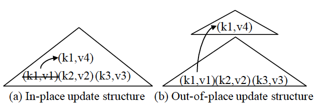
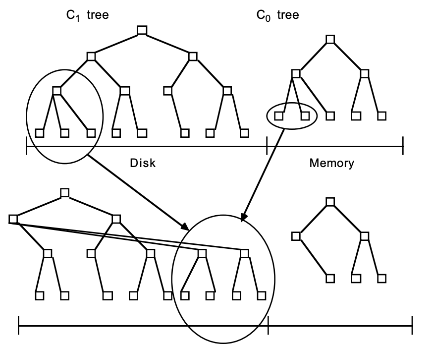
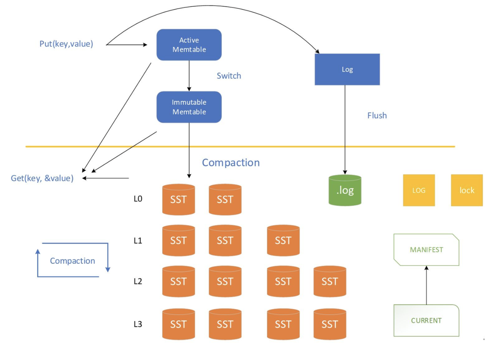
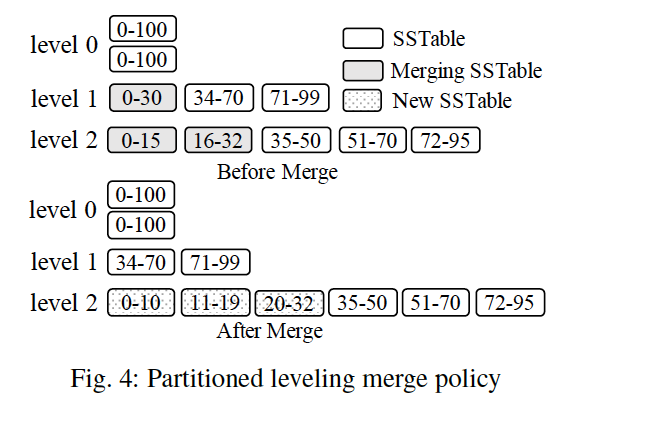
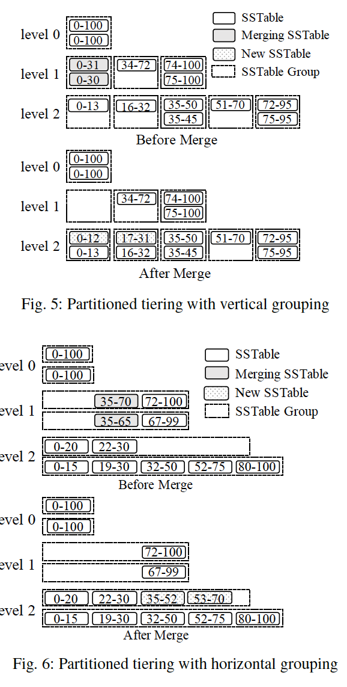

## 引言

近些年，日志结构化合并树（LSM tree）已被广泛使用在现在 NoSQL 系统的存储层。正因为如此，已经有了大量的研究工作，数据库社区和操作系统社区，也在尝试改进 LSM 树的各个方面。在本文中，我们对 LSM树的最新研究工作进行了综述，读者可以了解基于LSM存储的最新技术。我们讨论各类lsm各种方案的优势和权衡，并进一步调查了几个有代表性的，基于LSM的开源NoSQL系统，讨论了一些潜在的未来研究方向。

## 摘要

LSM-tree --- Log-Structured Merged-tree 

相比于传统的 in-place-updates 更新索引结构，LSM-tree 第一次写入都缓存在内存中，并通过后台的 flash 来顺序追加到磁盘中，我们称为 out-of-place updates。

**优点**：

- 写性能的提升
- 较高的空间利用率
- 简单的并发控制和异常恢复

## LSM 基础

### 历史

索引的结构更新策略：原地更新、非原地更新

#### 原地更新

例如，在图(1a)中，为了将与键 k1 相关的值从 v1 更新到 v4，直接修改索引条目（k1，v1）以应用此更新。 

因为仅存储每个记录的最新版本，对读性能提供高性能。但是改设计会牺牲写入性能，因为更新会导致随机 io，而且，索引页通过更新和删除操作会产生**分页**，从而降低了空间利用率。

> 分页是指索引页（或数据页）的部分空间变为不可用或无效的状态，通常发生在更新或删除操作中。
>
> 当进行更新或删除操作时，数据库引擎需要在索引页中找到对应的记录，并对其进行修改或删除。然而，由于索引页的大小是固定的，而记录的大小可能会发生变化，因此更新或删除操作可能导致索引页中出现空闲空间或未使用的空间。
>
> 当多次更新或删除操作发生时，索引页中的空闲空间可能会变得分散，形成多个不连续的段。这些分段的存在会导致空间利用率降低，因为它们占用了索引页的一部分空间但无法存储有效的记录。
>
> 分段的存在还会对数据库的性能产生影响。当进行查询操作时，数据库引擎需要扫描整个索引页，包括分段的空间，以找到符合条件的记录。这会增加查询操作的开销，降低查询的性能。
>
> 为了解决分段的问题，数据库引擎通常会进行空间重组或压缩操作，将分散的空间合并并释放未使用的空间。这样可以提高空间利用率，并且减少查询操作的开销。

详细可查看[数据库更新和删除原理](https://blog.csdn.net/weixin_41605937/article/details/122225457)

#### 非原地更新

out-of-update 结构（例如 LSM 树）始终将更新变化存储到新位置，而不是覆盖旧条目。 例如，在图(1b)中，更新（k1，v4）被存储到一个新位置，而不是直接更新旧条目（k1，v1）。 该设计可以利用顺序 I / O 来处理写操作，因此可以提高写性能。 通过不覆盖旧数据，它也可以简化恢复过程。 但是，该设计的主要问题是，由于记录可能存储在多个位置中的任何一个位置，因此牺牲了读取性能。 此外，这些结构通常需要单独的数据重组过程以不断提高存储和查询效率。

#### 历史问题

在 LSM 树之前，用于日志结构化存储的方法存在几个关键问题。 

- 首先，将数据存储到仅追加日志中会导致查询性能下降，因为相关记录分散在整个日志中。
- 另一个问题是由于尚未删除的过时记录而导致空间利用率低。 即使设计了各种数据重组过程，也没有统一标准的成本模型来分析写入/读取成本和空间利用率之间的折衷，这使得早期日志结构化存储难以优化。 
- 数据重组很容易成为性能瓶颈。

 1996年提出的 LSM 树通过设计一种集成到结构本身中的合并操作来解决上述问题，提供较高的写入吞吐、基于范围的高效查找 、友好的空间利用率。

- 原始的 LSM 树设计包含一系列组件 C0，C1，...，Ck，如图2所示。每个组件都被构造为B+树。 C0 驻留在内存中并处理传入的写操作，而所有其余组件 C1，Ck 都驻留在磁盘上。 Ci 满时，将触发滚动合并过程，以将一系列范围从 Ci 的叶子页面合并为 Ci + 1
- 如今，这种设计被引用到多层合并策略中。但是，正如我们稍后将要看到的那样，由于其实现复杂性，现今基于LSM的存储系统并未使用最初提出的滚动合并过程。关于 LSM 树的原始论文进一步表明，在稳定的 workload 下，层级数量保持不变，当所有相邻组件之间的大小比率 Ti = ｜Ci+1｜/｜Ci｜相同时，写性能能得到优化。该原则影响了 LSM 树的所有后续实现和改进。

与 LSM 树并行，Jagadish 等人提出了一种 stepped-merge 逐步合并策略的结构，可以实现更好的写入性能。 它将组件组织到各个级别中，并且当级别 L 充满 T 组件时，这些 T 组件将合并在一起成为级别 L + 1的新组件。 该策略成为当今 LSM 树实施中使用的分层合并策略。

### 如今的 LSM 形态

今天的 LSM-tree 架构仍然以 out-of-place updates 为主 通过顺序 I/O 来提升写性能。

#### 基本架构

所有的写入，都会追加到内存中的组件，不论是更新还是插入还是删除，都会以一个新的记录添加到内存中。

在内部，可以使用任何索引结构来实现 LSM 树组件。 当今的 LSM 树实现通常使用并发数据结构（如 skip-list 或 b+tree）来组织其内存组件，而它们使用 b+tree 或排序字符串表（SSTables）来组织其磁盘组件。 SSTable 包含一个数据块列表和一个索引块； 数据块存储按键排序的键值对，而索引块存储所有数据块的键范围。

在 LSM 树上的查询必须搜索多个组件，即查找每个 key 的最新版本：

- 点查询查询可获取特定键的值，可以简单地一个接一个地搜索所有组件，从最新到最旧，并在找到第一个匹配项后立即停止。
-  范围查询可以同时搜索所有组件，将搜索结果输入优先级队列以此获取最新数据。

问题：磁盘组件随着时间的推移而逐渐变多，由于必须查询更多组件，因此 LSM 树的查询性能趋于下降。为了解决这个问题，磁盘组件逐渐合并以减少总数。

在实践中通常使用两种类型的合并策略。如图 3 所示，两个策略都将磁盘组件组织为层，并由大小比 T 控制。每个组件在图中均标有其相关的 key 范围。

在**层合并策略**（图3a）中，**每个级别仅维护一个组件**，但是级别 L 的组件比级别 L-1 的组件大 T 倍。因此，级别 L 的组件将与级别 L-1的传入组件多次合并，直到其被填满，然后将其合并为级别 L + 1。

> 例如，在图中，级别0的组件与级别1的组件合并，这将导致级别1的组件更大。

相反，**分层合并策略**（图3b）在每个级别可能维护 T 个组件。当级别 L 已满时，这些组件将合并在一起成为级别 L + 1的新组件。

> 在图中，级别 0 的两个组件将合并在一起形成级别 1 的新组件。值得注意的是如果级别 L 已经是配置的最大级别时，则结果组件将保持在级别 L。实际上，对于稳定的 workload（插入量等于删除量），级别总数保持不变。

**通常，由于LSM树中要搜索的组件较少，因此层合并策略针对查询性能进行了优化。分层合并策略由于降低了合并频率而对写入进行了更多的优化。**

#### 众所周知的优化

目前，大多数LSM-树实现都使用两种众所周知的优化方法。

##### 布隆过滤器

布隆过滤器是一种空间高效的概率数据结构，旨在快速判断元素是否存在。

 它支持两种操作，即插入 key 并测试给定 key 是否存在。 

- 要插入 key，将 key 应用多个哈希函数，将计算的哈希结果值映射到位向量中的多个位置，并将这些位置的位设置为1。
- 要检查给定 key 的存在，将 key 再次哈希到多个位置。 如果所有位均为1，则布隆过滤器报告该 key 可能存在。

##### 分区

将 LSM 树的磁盘组件范围划分为多个（通常是固定大小的）小分区。为了最小化由不同术语引起的潜在混乱，我们遵循 LevelDB 的术语，使用术语 SSTable 来表示这样的分区。该优化具有多个优点。

- 首先，分区将大型组件合并操作分解为多个较小的合并操作，从而限制了每个合并操作的处理时间以及创建新组件所需的临时磁盘空间。

- 仅合并键范围重叠的组件。

  - 对于顺序创建的键，由于不存在具有重叠键范围的组件，因此基本上不执行合并。

  - 对于分布不均匀数据的更新，可以大大降低涉及**冷更新范围**的组件的合并频率。

    > 比如 key 的范围是 1～100 的数据，其中经常变化的是 50～100 的范围，如果放在一个 sst 中，前面的1～50的数据不得不跟着合并等操作，但是拆分之后，我就可以只移动和合并 50～100 范围的 key 所在的 sst 了。

**！我们看一下 LevelDB 在分区合并策略中的实现**

如图 4 所示：leveldb 将每个磁盘组建范围划分为多个大小固定额 SST，示例中每个都标有其键范围。**LevelDB 应该为层合并策略**

级别 0 的磁盘组件未分区，因为它们是直接从内存中刷新的。此设计还可以帮助系统处理突发写入场景，因为它可以接受 0 级的多个未分区组件。

要将 L 级的 SSTable 合并到 L + 1 级，请选择 L + 1 级的所有键重叠的 SSTable，然后选择这些将 SSTables 与其合并以生成仍处于 L + 1级的新 SSTables。例如，在图中，将 L1 标记为 0-30 的 SSTable 与 L2 标记为 0-15 和 16-32 的 SSTable 合并。此合并操作将生成标记为 0-10、11-19 和 L2 中的 20-32，则旧的 SSTables 将被垃圾收集。可以使用不同的策略来选择每个级别下要合并的 SSTable。例如，LevelDB 使用循环策略（以最小化总写入成本）。

> 这是因为 SSTable 的大小一般是固定的，而表现出来的性质，并不是提前预设的要求。  SSTable 的大小固定，越到下层，数据规模越大，在单个 SSTable 能存的 key 的范围就更大概率更小了。 比如，图中例子，merge 前，  0-30（level 1)中 0-15的部分  和 0-15(level2) 合并之后，数据规模大于了 SSTable 的大小，所以就需要将前 0-10 的数据分裂出一个 SSTable。

**！分区在分层合并策略下的应用**

主要分为 垂直分组 和 水平分组

在这两种方案中，每个级别的 SSTable 都被分组。 垂直分组方案将具有重叠键范围的 SSTables 分组在一起，以便这些组具有不相交的键范围。 因此，可以将其视为分区级别的扩展以支持分层。 或者，在水平分组方案下，每个逻辑磁盘组件（范围划分为一组 SSTable）直接用作一个组。 这允许以 SSTables 为单位逐步形成更大的 SSTTable。 我们将在下面详细讨论这两种方案。

垂直分组方案的示例如图 5 所示。在此方案中，将具有重叠键范围的 SSTables 分组在一起，以便这些组具有不相交的键范围。 在合并操作期间，将组中的所有 SSTable 合并在一起，以根据下一级重叠组的键范围生成最终的 SSTable，然后将这些 SSTable 添加到这些重叠组中。 例如，在图中，将 L1 标记为 0-30 和 0-31 的 SSTable 合并在一起以生成标记为 0-12 和 17-31 的 SSTable，然后将它们添加到 L2 的重叠组中。请注意区别在此合并操作之前和之后的 SSTable 之间。

在合并操作之前，标记为 0-30 和 0-31 的SSTable具有重叠的键范围，并且必须通过点查找查询将它们一起检查。 但是，在合并操作之后，标记为 0-12 和 17-31 的SSTable具有不相交的键范围，并且仅其中一个需要由点查找查询检查。 还应注意，在此方案下，SSTable不再是固定大小的，因为它们是根据下一级重叠组的关键范围生成的。

图6显示了水平分组方案的示例。在此方案中，每个组件（范围划分为一组固定大小的 SSTables）直接用作逻辑组。每个级别 L 进一步维护一个活动组，该组也是第一个组，以接收从先前级别合并的新 SSTables。在未分区的情况下，可以将该活动组视为通过合并级别 L-1 的组件而形成的部分组件。合并操作是指从一个级别的所有组中选择具有重叠键范围的 SSTable，然后将生成的 SSTable 添加到下一个级别的活动组。例如，在图中，将级别 1 标记为 35-70 和 35-65 的 SSTable 合并在一起，并将结果标记为 35-52 和 53-70 的 SSTable 添加到级别 2 的第一组中。如在水平分组方案下使用固定大小的分组，则一个组中的一个SSTable仍然有可能与其余组中大量 SSTable 重叠。

#### 并发控制和恢复

对于并发控制，LSM 树需要处理并发读写，并注意并发刷新和合并操作。

并发的刷新和合并操作对于 LSM 树是唯一的。这些操作会修改 LSM 树的元数据（例如活动组件的列表），因此必须正确同步对组件元数据的访问。为了防止删除使用中的组件，每个组件都可以维护一个**引用计数器**。在访问 LSM 树的组件之前，查询首先可以获取活动组件的快照并增加其使用中的计数器。

由于所有写操作都首先添加到内存中，因此可以执行预写日志记录（WAL）以确保其持久性。为简化恢复过程，现有系统通常采用 no-steal 缓冲区管理策略（NO-STEAL 是指没有 commit 的 transaction 修改的 page 不可以被写入硬盘）。也就是说，内存组件可以仅当所有活动的写事务都停止时才刷新。在恢复 LSM 树的过程中，将重放事务日志以重做所有成功的事务，但是由于采用了“no-steal”策略，因此无需撤消操作。同时，万一发生崩溃，还必须恢复活动磁盘组件的列表。

- 对于未分区的 LSM 树，可以通过在每个磁盘组件上添加一对时间戳来指示所存储条目的时间戳范围来实现。可以使用本地时钟时间或单调序列号简单地生成此时间戳。要重建组件列表，恢复过程可以简单地找到所有时间戳不相交的组件。如果多个组件的时间戳重叠，则选择时间戳范围最大的组件，其余的可以简单地删除，因为它们将被合并以形成所选的组件。
- 对于分区的 LSM 树，此基于时间戳的方法不再起作用，因为每个组件都经过了范围分区。为了解决这个问题，在 LevelDB 和RocksDB 中使用的一种典型方法是维护一个单独的元数据日志，以存储对结构元数据的所有更改。例如添加或删除 SSTables。LSM树的状态然后可以通过在恢复过程中重放元数据日志来重建结构。

### LSM 的改进

#### 改进分类

- 写放大

尽管 LSM 树可以通过减少随机 I / O 来提供比 B +树 之类的就地更新结构更好的写吞吐量，并且 leveling 合并策略已被 LevelDB 和RocksDB 等现代键值存储所采用， 但仍然会产生较高的写入放大率。高写入放大率不仅限制了 LSM树 的写入性能，而且由于频繁的磁盘写入而缩短了 SSD 的使用寿命。

> 写放大（Write Amplification）是指写入操作引起的额外磁盘写入量。由于 LSM 树的设计特性，写放大是不可避免的。
>
> 写放大的原因如下：
>
> 1. 内存写入：每次写入操作都会将数据写入到内存中的 Memtable，这是一个高速的写入操作，不会引起写放大。
> 2. 写入到磁盘：当 Immemtable 的大小达到一定阈值后，会将其刷写到磁盘上的一个新的 SSTable 中。这个过程涉及到磁盘的写入操作，会引起写放大。
> 3. 合并操作：LSM 树中的 SSTables 可能存在多个层级，为了维护数据的有序性和减少查询操作的开销，需要定期进行合并操作。合并操作会将多个 SSTables 合并为一个更大的 SSTable，这也会引起额外的写入操作。
>
> 为了减少写放大的影响，LSM 树采用了一些优化策略，例如**批量写入、压缩操作、延迟合并**等。这些策略可以减少磁盘写入量和合并操作的频率，从而降低写放大的程度。

- 合并操作

合并操作对于 LSM 树的性能至关重要，因此必须谨慎实施。 此外，合并操作可能会对系统产生负面影响，包括合并后的缓冲区中高速缓存是否命中以及超大合并期间的写入停顿。 已经提出了一些改进来优化合并操作以解决这些问题。

- 硬件

为了最大化性能，必须仔细实施 LSM 树以充分利用基础硬件平台。 原始的 LSM 树是为硬盘设计的，目的是减少随机 I / O。 近年来，新的硬件平台为数据库系统实现更好的性能提供了新的机会。 最近的大量研究致力于改善 LSM 树，以充分利用底层硬件平台，包括大内存，多核，SSD / NVM 和块存储。

- 特殊工作场景

除了硬件之外，在这些场景中，还可以考虑某些特殊的工作场景以获得更好的性能。

- 自动调参

基于 RUM 猜想，没有一种访问方法可以同时读取最佳，写入最佳和空间最佳。 LSM 树的可调性是一种有前途的解决方案，可以针对给定的工作负载实现最佳的折衷。 但是，由于太多的调整参数（例如内存分配，合并策略，大小比率等），LSM 树可能难以调整。为解决此问题，文献中提出了几种自动调整技术。

- 二级索引

给定的 LSM 树仅提供简单的键值接口。 为了支持对非关键属性的查询的有效处理，必须维护辅助索引。 该领域的一个问题是如何以少量的写性能开销有效地维护一组相关的二级索引。 还设计和评估了各种基于 LSM 的二级索引结构和技术。

